-   [1 Introduction](#introduction)
-   [2 Getting Started](#getting-started)
    -   [2.1 Loading R packages and phyloseq
        object](#loading-r-packages-and-phyloseq-object)
    -   [2.2 Calculate beta diversity
        ordination](#calculate-beta-diversity-ordination)
    -   [2.3 Calculating trajectories](#calculating-trajectories)
    -   [2.4 Plotting the trajectories](#plotting-the-trajectories)
        -   [2.4.1 Plotting individual
            trajectories](#plotting-individual-trajectories)
        -   [2.4.2 Plotting trajectories with sample timepoint
            summary](#plotting-trajectories-with-sample-timepoint-summary)
    -   [2.5 Trajectories versus fixed
        measures](#trajectories-versus-fixed-measures)
    -   [2.6 Trajectories versus repeated
        measures](#trajectories-versus-repeated-measures)
        -   [2.6.1 Visualizing the results](#visualizing-the-results)
    -   [2.7 Cox regression of asthma acquisition over
        time](#cox-regression-of-asthma-acquisition-over-time)
-   [3 Ending Thoughts](#ending-thoughts)

# 1 Introduction

This is a quick overview of Latent Class Growth Analyses (LCGA) or, as
the lab calls them, Growth Mixture Models (GMM). Briefly, these are
models that can be used to identify latent subgroups, classes or
clusters of individuals based on their common growth trajectories over
time. Refer to this paper for more information on LCGA/GMM models
(<https://compass.onlinelibrary.wiley.com/doi/10.1111/j.1751-9004.2007.00054.x>).
Most of (if not all) the methods to produce the LCGA or GMM are from
this resource (<https://osf.io/preprints/psyarxiv/m58wx_v1>). These
papers can also be found in my box folder for LAMB
(~/Library/CloudStorage/Box-Box/20241009_LAMB_analysis/papers/).

# 2 Getting Started

## 2.1 Loading R packages and phyloseq object

First, we need to install/load our packages and data. - These data are
from the LAMB study, which are airway 16S microbiome data collected from
three cohorts (COAST, IIS, and URECA) across 10 years of age. The goal
was to find airway microbiome development trajectories and relate them
to allergic outcomes such as wheezing, asthma, eczema, and other
variables.

``` r
# Read in data
phy<-readRDS("~/Library/CloudStorage/Box-Box/20241009_LAMB_analysis/LAMB_16S_processing_files/dada2_combined_runs_final_processing/20250610_lamb_phy_rare_rep_only_FINAL.rds")
# remove single 11 year sample
phy<-subset_samples(phy, !(sample_data(phy)$AGE_MOS_BMIZ_BIN==132))

# find subset of OTUs that are dominant genera
phy_abundance <- tax_glom(phy, taxrank = "Genus")
phy_relabund <- transform_sample_counts(phy_abundance, function(x) x/sum(x))

# pull out dfs from the phyloseq object
sam<-data.frame(sample_data(phy_abundance))
taxa<-data.frame(tax_table(phy_abundance))

# Calculate dominant genus for these six taxa, rest are considered "Other"
sam$domgen_sum<-
  factor(
    
    ifelse(!(sample_data(phy_abundance)$Genus %in% 
               c("Moraxella","Streptococcus","Staphylococcus",
                 "Dolosigranulum","Corynebacterium","Haemophilus")),
           "Other",
           sample_data(phy_abundance)$Genus),
    
  levels=c("Moraxella","Streptococcus",
         "Staphylococcus","Dolosigranulum",
         "Corynebacterium","Haemophilus","Other")
  )

# merge back to phy object
sample_data(phy)<-sample_data(sam)
```

## 2.2 Calculate beta diversity ordination

The method I used to create microbiome trajectories was to ordinate the
data, take the coordinates of each sample’s Principle Component 1 (PC1)
and PC2, then you can model each PC versus age to find latent
development trajectories.

First, we ordinate the data. I also included a step to calculate
statistics for your variable of interest versus the overall ordination.
This can be useful in identifying potential confounding factors that
you’ll want to adjust or otherwise account for later. - Note that
several steps will use custom code located in my Box folder
(~/Library/CloudStorage/Box-Box/general_analysis_scripts/). You’ll need
to be given access to this folder and your R will need to be able to
access box–I won’t be going over this here, so just a heads up.

``` r
## calc beta diversity
# step 1: calculate PCoA ordination
temp_beta<-beta_div_calc(phy,
                         dists = c("bray","sorensen"))
saveRDS(temp_beta, "~/Library/CloudStorage/Box-Box/general_analysis_scripts/LCGA_LAMB_example/beta_ordination.rds")

# step 2: run PERMANOVA models
# not run here because we're interested in repeated measures
test_stats<-beta_div_stats(phy=phy,
                           model_vars=c("AGE_MOS_BMIZ_BIN","domgen_sum"),
                           subjectid = "ParticipantID",
                           dists = c("bray","sorensen"))

# step 2 (alternative) run LME models across PC1 and PC2: 
temp_stats<-beta_div_stats_lme(phy=phy, 
                               beta_div_calc=temp_beta, 
                               model_vars=c("AGE_MOS_BMIZ_BIN","domgen_sum"), 
                               subjectid="SUBJID",
                               dists=c("bray","sorensen"))
saveRDS(temp_stats, "~/Library/CloudStorage/Box-Box/general_analysis_scripts/LCGA_LAMB_example/beta_stats.rds")

# step 3: combine into one output and save
phy_beta_stats<-list(temp_beta, temp_stats)
saveRDS(phy_beta_stats,"~/Library/CloudStorage/Box-Box/general_analysis_scripts/LCGA_LAMB_example/beta_ordination_lme.rds")
```

In the step above, I like to save the output of the beta diversity
ordination and my stats to save on compute time downstream. You don’t
have to do this, but it’s more efficient to only compute your ordination
and stats once and read those results into R later, just keep in mind
you’ll have to rerun these steps if you change something in your dataset
or methods.

Here, we’re going to only use Sorensen for downstream analysis, so we’re
going to save the coordinates into our sam file for easier access.

``` r
# read in beta diversity ordinations and stats
temp_beta<-readRDS("~/Library/CloudStorage/Box-Box/general_analysis_scripts/LCGA_LAMB_example/beta_ordination.rds")
temp_stats<-readRDS("~/Library/CloudStorage/Box-Box/general_analysis_scripts/LCGA_LAMB_example/beta_stats.rds")

# append point coordinates from ordination to sam file for downstream use
# pull out coordinates, check they're aligned to the sam file
sor_coord<-temp_beta$sorensen$points
table(rownames(sam)==rownames(sor_coord))

# merge to sam
# sorensen
sam$sorensen_axis1<-sor_coord[,1]
sam$sorensen_axis2<-sor_coord[,2]
```

Let’s see how our ordinations and stats look.

``` r
# # step 5: plot ordination and stats
pl<-beta_div_plots(phy = phy,
                    beta_div = temp_beta,
                    stats=temp_stats,
                    model_vars="domgen_sum"
                   )
```

``` r
ggarrange(pl[[1]][[1]],
          pl[[2]][[1]],
          pl[[3]][[1]],
          pl[[4]][[1]],
          common.legend = T
          )
```

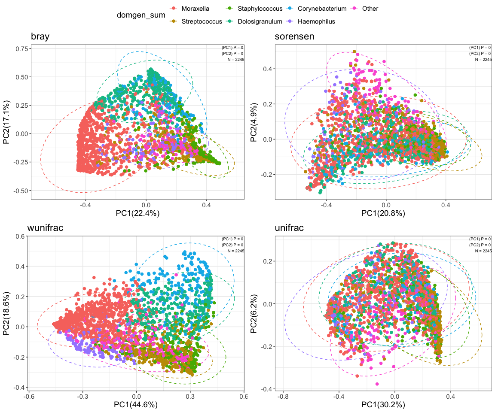

``` r
# output stats table
tab<-beta_div_stats_table(temp_stats)
tab
```

## 2.3 Calculating trajectories

This is wrapper code that goes through stepFlexmix, a programs that
allows for testing of several parameters at once and collects the output
for us. Note that you can change the number of clusters you search for
(below it’s from 1-5), the number of reps (increase to 100+), number of
iterations (increase to 500+), and the “models” option accepts the terms
“lcga”, “gmm”, and “gmm2”. - lcga: fixed intercept and slope - gmm:
random intercepts, fixed slope - gmm2: random intercepts and slopes

You can run a model with all of these included
(models=c(“lcga”,“gmm”,“gmm2”)) and compare the Baysian Information
Criterion (BIC) scores, where lower is better (including in cases where
they become negative numbers). Since gmm and gmm2 take a very long time
to run, we are not doing it here. However, in this case, LCGA is best so
we go with that.

``` r
models_sor_pc1<-lcga_gmm_calc(sam_data=sam,
                                  y_var="sorensen_axis1",
                                  age_col="AGE_MOS_BMIZ_BIN",
                                  models="lcga",
                                  cluster_min=1, cluster_max=5,
                                  nrep=10, # increase to 100+
                                  subjectid = "SUBJID",
                                  iter.max=50, # increase to 500+
                                  seed=31415)
models_sor_pc2<-lcga_gmm_calc(sam_data=sam,
                                  y_var="sorensen_axis2",
                                  age_col="AGE_MOS_BMIZ_BIN",
                                  models="lcga",
                                  cluster_min=1, cluster_max=5,
                                  nrep=10, # increase to 100+
                                  subjectid = "SUBJID",
                                  iter.max=50, # increase to 500+
                                  seed=31415)

sor_collect<-list(pc1=models_sor_pc1,
                 pc2=models_sor_pc2)

saveRDS(sor_collect, "~/Library/CloudStorage/Box-Box/general_analysis_scripts/LCGA_LAMB_example/sorensen_lcga_model.rds")
```

## 2.4 Plotting the trajectories

Now that we’ve calculated the trajectories along PC1 and PC2, we look at
the BIC values for each trajectory level (1-5 in our case). For both PC1
and PC2 we have two trajectories as optimal. We then combine them into
one trajectory term for PC1 and PC2, represented here as 1-1, 1-2, 2-1,
2-2.

``` r
# read in LCGA model
sor_models<-readRDS("/Users/ksugino/Library/CloudStorage/Box-Box/20241009_LAMB_analysis/20241105_LAMB_analysis_code/outputs/20250612_LAMB_sorensen_lcga_models.rds")
# check for best fitting model
lcga_gmm_table(models = sor_models$pc1)
```

<table class="table table-bordered" style="color: black; width: auto !important; margin-left: auto; margin-right: auto;">
<thead>
<tr>
<th style="empty-cells: hide;border-bottom:hidden;" colspan="1">
</th>
<th style="border-bottom:hidden;padding-bottom:0; padding-left:3px;padding-right:3px;text-align: center; font-weight: bold; " colspan="1">

LCGA

</th>
</tr>
<tr>
<th style="text-align:left;font-weight: bold;">
cluster
</th>
<th style="text-align:left;font-weight: bold;">
lcga
</th>
</tr>
</thead>
<tbody>
<tr>
<td style="text-align:left;">
1
</td>
<td style="text-align:left;">
<span style="     color: black !important;">176.67</span>
</td>
</tr>
<tr>
<td style="text-align:left;">
2
</td>
<td style="text-align:left;">
<span style="     color: red !important;">83.862</span>
</td>
</tr>
<tr>
<td style="text-align:left;">
3
</td>
<td style="text-align:left;">
<span style="     color: black !important;">107.011</span>
</td>
</tr>
<tr>
<td style="text-align:left;">
4
</td>
<td style="text-align:left;">
<span style="     color: black !important;">130.161</span>
</td>
</tr>
<tr>
<td style="text-align:left;">
5
</td>
<td style="text-align:left;">
<span style="     color: black !important;">153.31</span>
</td>
</tr>
</tbody>
</table>

``` r
lcga_gmm_table(models = sor_models$pc2)
```

<table class="table table-bordered" style="color: black; width: auto !important; margin-left: auto; margin-right: auto;">
<thead>
<tr>
<th style="empty-cells: hide;border-bottom:hidden;" colspan="1">
</th>
<th style="border-bottom:hidden;padding-bottom:0; padding-left:3px;padding-right:3px;text-align: center; font-weight: bold; " colspan="1">

LCGA

</th>
</tr>
<tr>
<th style="text-align:left;font-weight: bold;">
cluster
</th>
<th style="text-align:left;font-weight: bold;">
lcga
</th>
</tr>
</thead>
<tbody>
<tr>
<td style="text-align:left;">
1
</td>
<td style="text-align:left;">
<span style="     color: black !important;">-3338.764</span>
</td>
</tr>
<tr>
<td style="text-align:left;">
2
</td>
<td style="text-align:left;">
<span style="     color: red !important;">-3358.647</span>
</td>
</tr>
<tr>
<td style="text-align:left;">
3
</td>
<td style="text-align:left;">
<span style="     color: black !important;">-3335.655</span>
</td>
</tr>
<tr>
<td style="text-align:left;">
4
</td>
<td style="text-align:left;">
<span style="     color: black !important;">-3312.697</span>
</td>
</tr>
<tr>
<td style="text-align:left;">
5
</td>
<td style="text-align:left;">
<span style="     color: black !important;">-3289.527</span>
</td>
</tr>
</tbody>
</table>

``` r
# pull out cluster 2 for each PC
sor_pc1<-sor_models$pc1$lcga@models[[2]]@cluster
sor_pc2<-sor_models$pc2$lcga@models[[2]]@cluster
# combine PC1 and PC2 clusters into one
sor_clust<-paste0(sor_pc1, "-",sor_pc2)
# write to sample data
sam$sor_clust<-sor_clust

# pull out soresen ord
ord<-temp_beta$sorensen

p<-plot_ordination_trajectories(sam=sam,
                              trajectory_name<-"sor_clust",
                              age_name<-"AGE_MOS_BMIZ_BIN",
                              pc1_name<-"sorensen_axis1",
                              pc2_name<-"sorensen_axis2",
                              id_name<-"SUBJID",
                              beta_ord<-ord,
                              point_cols_name<-"domgen_sum",
                              point_cols_legend<-"Dominant Genus",
                              trajectory_label<-c("TI","TII","TIII","TIV"),
                              trajectory_shape=c(21, 22, 23, 24),
                              trajectory_cols=c("#3884ec", "#57cae3", "#c638ec", "#E07A5F")
         )

# since we're using ggplot, to some extent we can adjust the plot to fit our needs
p +
  scale_fill_brewer(palette="Greens", 
                    name="Age (Years)", 
                    labels=c(1,2,3,5,6,7,8,9,10))
```

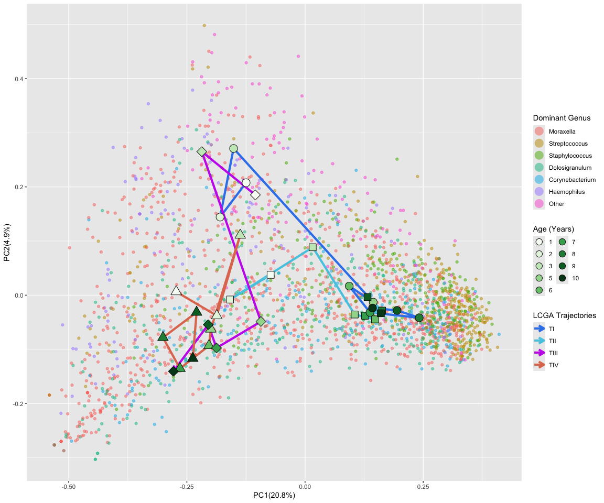

### 2.4.1 Plotting individual trajectories

It’s a little hard to see the trajectory samples, so let’s split them up
and replot each trajectory individually. This uses utility code in the
LCGA code set

``` r
# subset plots to each cluster trajectory
c11<-subset_ord(sam=sam, beta_ord=ord,axis1="sorensen_axis1", trajectory_name="sor_clust",
                axis2="sorensen_axis2",sam_sub = "1-1", age_name<-"AGE_MOS_BMIZ_BIN",
                trajectory_col="#3884ec",point_cols_name = "domgen_sum")
c12<-subset_ord(sam=sam, beta_ord=ord,axis1="sorensen_axis1", trajectory_name="sor_clust",
                axis2="sorensen_axis2",sam_sub = "1-2", age_name<-"AGE_MOS_BMIZ_BIN",
                trajectory_col="#57cae3",point_cols_name = "domgen_sum")
c21<-subset_ord(sam=sam, beta_ord=ord,axis1="sorensen_axis1", trajectory_name="sor_clust",
                axis2="sorensen_axis2",sam_sub = "2-1", age_name<-"AGE_MOS_BMIZ_BIN",
                trajectory_col="#c638ec",point_cols_name = "domgen_sum")
c22<-subset_ord(sam=sam, beta_ord=ord,axis1="sorensen_axis1", trajectory_name="sor_clust",
                axis2="sorensen_axis2",sam_sub = "2-2", age_name<-"AGE_MOS_BMIZ_BIN",
                trajectory_col="#E07A5F",point_cols_name = "domgen_sum")

ggarrange(c11, c12, c21, c22)
```

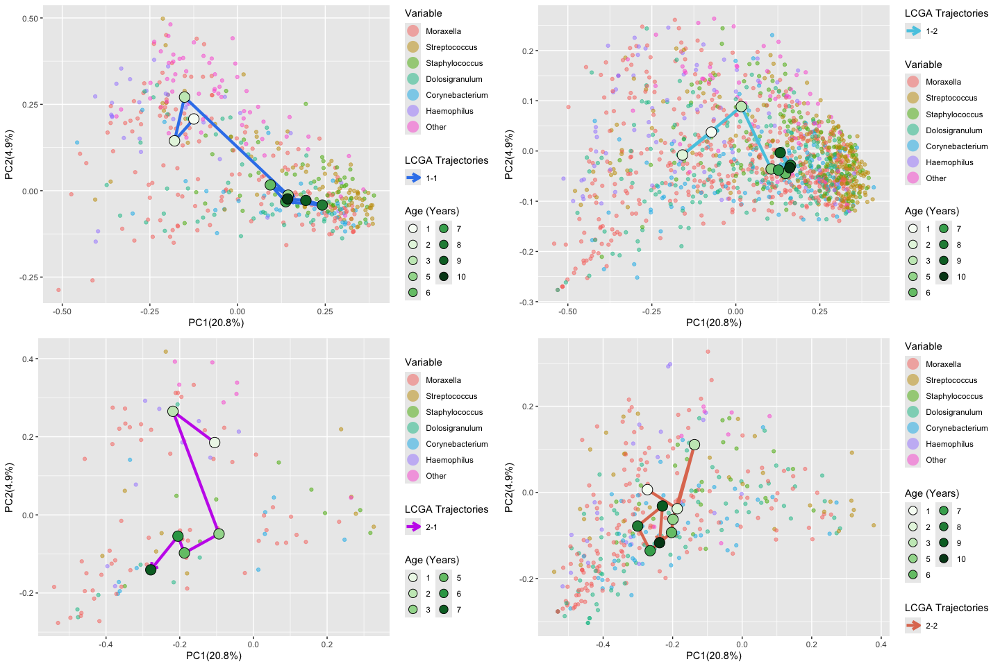

### 2.4.2 Plotting trajectories with sample timepoint summary

And since we’re using repeated measures data with a lot a missing data,
let’s see what the data actually look like within each trajectory across
time.

Note that this function below is written to only work with my data
structure; sorry!

``` r
# subset plots to each cluster trajectory
paired_samples<-function(sam, sam_sub){
  # paired samples by cluster
  # visualizing the repeated measures sampling
  sam_temp<-subset(sam, sam$sor_clust==sam_sub)[,c("SUBJID","Study","AGE_MOS_BMIZ_BIN","sor_clust")]
  test<-reshape2::dcast(sam_temp, SUBJID + Study ~ AGE_MOS_BMIZ_BIN)
  # convert clusters to 1
  test[,-c(1:2)][!is.na(test[,-c(1:2)])]<-1
  
  # find the number of longitudinal data I have, regardless of actual timepoints
  test$tot<-rowSums(!is.na(test[,-c(1:2)]))
  # name the timepoints by pasting together the timepoints
  temp<-data.frame()
  for(i in 1:nrow(test)){
    temp[i,1]<-paste0(ifelse(!is.na(test[i,-c(1:2,12)]),paste(colnames(test[i,-c(1:2,12)])), NA),collapse = "-")
  }
  test<-data.frame(test, temp)
  
  # summarize
  rep_meas_summary<- test %>%
    group_by(Study, V1) %>%   # grouping
    dplyr::summarise(Freq = n())
  # merge to larger df
  temp_merge<-merge(test, rep_meas_summary, by=c("Study","V1"))
  # remove dupes
  merge_nodupes<-temp_merge[!duplicated(data.frame(temp_merge$Study,temp_merge$V1)),]
  # merge_nodupes<-merge_nodupes[-50,]
  # convert NA to 0 and numbers to 1
  merge_nodupes[merge_nodupes==0]<-1
  merge_nodupes[merge_nodupes==(-9)]<-1
  merge_nodupes[is.na(merge_nodupes)]<-0
  
  # hard code this in to fill out column names
  if(!"X24" %in% colnames(merge_nodupes)){
    temp<-data.frame(X24=rep(0, nrow(merge_nodupes)))
    merge_nodupes<-cbind(merge_nodupes, temp)
  }
  if(!"X72" %in% colnames(merge_nodupes)){
    temp<-data.frame(X72=rep(0, nrow(merge_nodupes)))
    merge_nodupes<-cbind(merge_nodupes, temp)
  }
  if(!"X96" %in% colnames(merge_nodupes)){
    temp<-data.frame(X96=rep(0, nrow(merge_nodupes)))
    merge_nodupes<-cbind(merge_nodupes, temp)
  }
  
  
  # melt
  melted<-reshape2::melt(merge_nodupes,
                         id.vars = c("V1","Study","Freq","tot"),
                         measure.vars = c("X12","X24","X36","X60","X72","X84","X96","X108","X120"))
  
  # idk why i have to do this, but it only works if I do
  # I think the melt creates a full matrix (whether the data exists at that timecourse or not)
  # so value removing value=0 removes any false timeseries data
  melt_sub<-subset(melted,melted$value==1)
  melt_sub<-melt_sub[order(melt_sub$Freq,decreasing = T),]
  
  n<-ifelse(melt_sub$tot>1, "Repeated","Single")
  melt_sub$n<-n
  # rename variable
  colnames(melt_sub)[5]<-"Age_Months"
  
  a<-table1(~ Study | Age_Months, 
       data=melt_sub,
       # extra.col=list(`P-value`=pvalue),
       overall=F,
       caption = "")
  
  a<-tableGrob(data.frame(a))
  return(a)
}

rep1<-paired_samples(sam=sam, sam_sub = "1-1")
rep2<-paired_samples(sam=sam, sam_sub = "1-2")
rep3<-paired_samples(sam=sam, sam_sub = "2-1")
rep4<-paired_samples(sam=sam, sam_sub = "2-2")

ggarrange(c11, rep1,ncol = 1, heights = c(2,1))
```

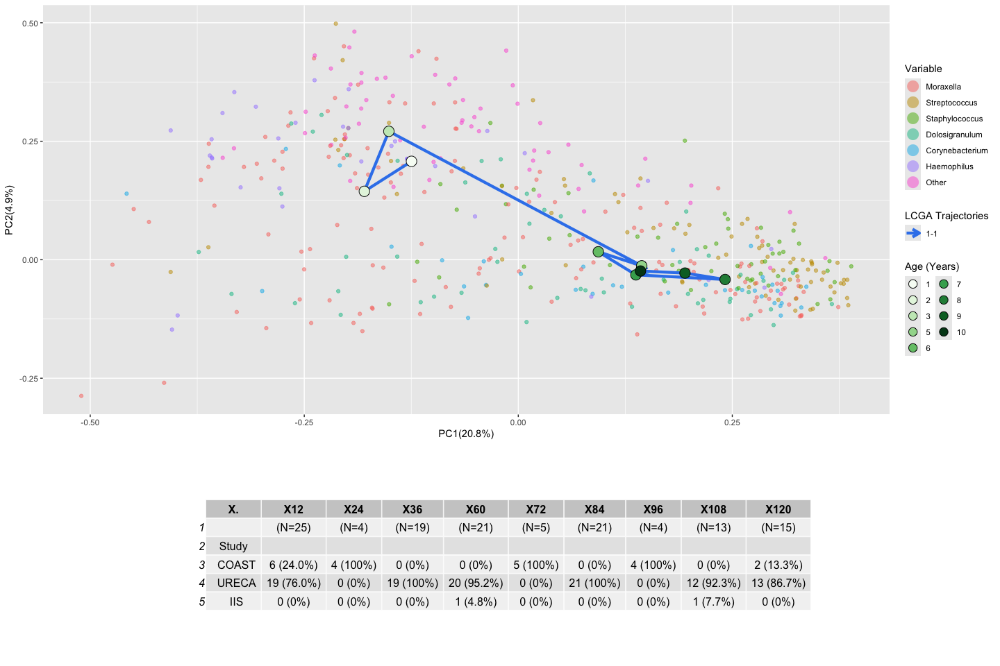

``` r
ggarrange(c12, rep2,ncol = 1, heights = c(2,1))
```

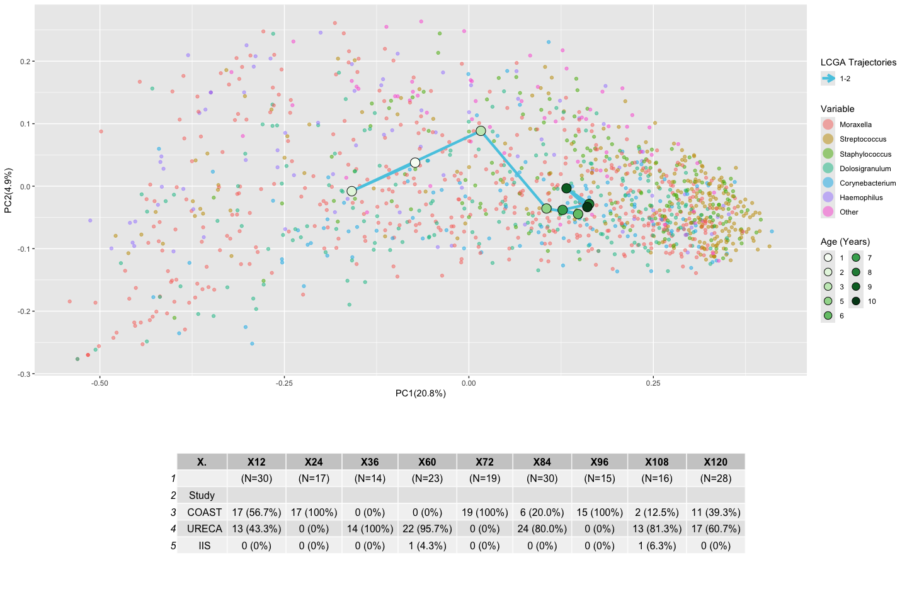

``` r
ggarrange(c21, rep3,ncol = 1, heights = c(2,1))
```

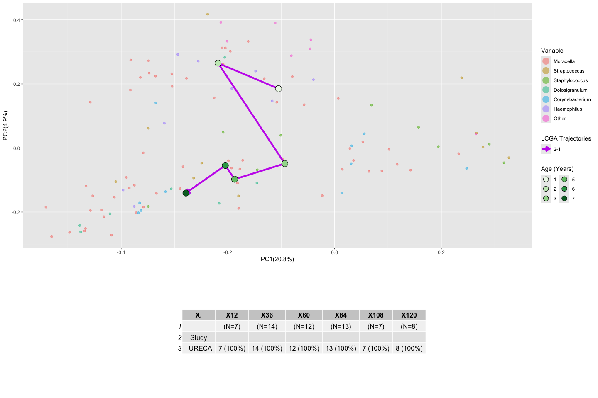

``` r
ggarrange(c22, rep4,ncol = 1, heights = c(2,1))
```

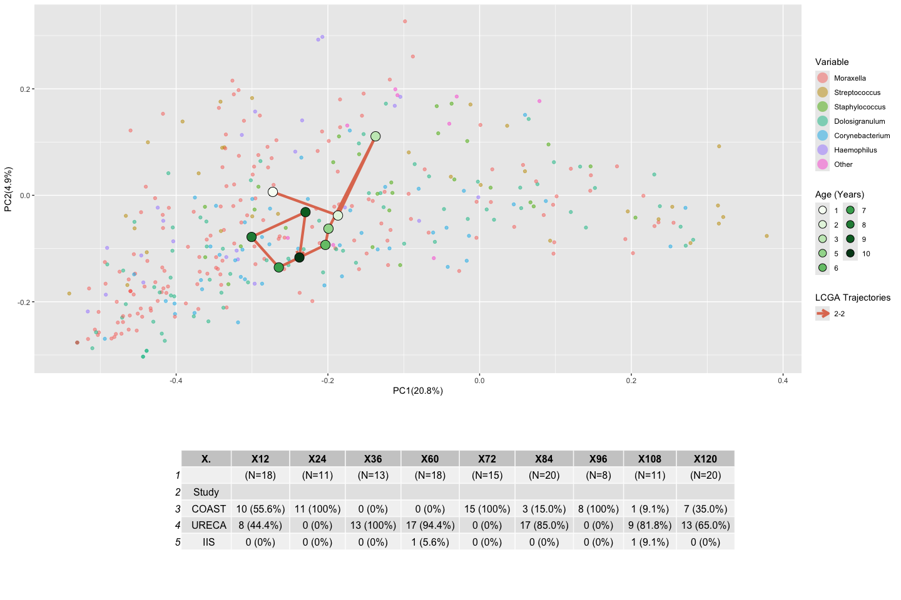

## 2.5 Trajectories versus fixed measures

In my data, there are several variables that can be considered fixed,
i.e., variables that do not change across time such as sex, delivery
mode, and others. Here, we subset the data down to unique participant
IDs to analyze fixed effects versus trajectory.

``` r
pvalue <- function(x, ...) {
  # Construct vectors of data y, and groups (strata) g
  y <- unlist(x)
  g <- factor(rep(1:length(x), times=sapply(x, length)))
  if (is.numeric(y)) {
    # For numeric variables, perform a standard 2-sample t-test
    temp <- aov(y ~ g)
    p <- summary(temp)[[1]][["Pr(>F)"]][1]
  } else {
    # For categorical variables, perform a chi-squared test of independence
    p <- chisq.test(table(y, g))$p.value
  }
  # Format the p-value, using an HTML entity for the less-than sign.
  # The initial empty string places the output on the line below the variable label.
  c("", sub("<", "&lt;", format.pval(p, digits=4, eps=0.001)))
}

# remove missing codes, etc.
# Edit -9 and -6 values to NA
temp_sam<-sam
temp_sam[temp_sam=="-9"]<-NA
temp_sam[temp_sam=="-6"]<-NA
temp_sam[temp_sam=="-7"]<-NA
temp_sam[temp_sam=="-99"]<-NA
temp_sam[temp_sam=="-5"]<-NA

sam<-temp_sam

# set up repeated measures vairables and fixed variables; collect the latter into one unique df and compare to cluster, the former plot across time.
static<-c("SUBJID","SEX", "GA_WKS","BWGT_GRAMS", "CSECT", "BREASTFEDDUR","MEDHHINC_ADJ","ANTIBIOTICSEXPOSURE_OY","MAT_ASTHMA", "PAT_ASTHMA", "AR_5_7_YRS", "AR_8_PLUS_YRS","ASTHMA_AGE","ASTHMA_DEF_1","asthma_def_2","sor_clust")
sam_static<-data.frame(sam[,static])
sam$sor_clust<-factor(sam$sor_clust, levels=c("2-1","1-1", "1-2", "2-2"))
# subset down to unique values only (since we don't care about timepoint anymore)
sam_unique<-sam_static[!duplicated(sam_static$SUBJID),]

# convert vars to formula vars
f_vars<-paste(static[-1], collapse="+")

table1(as.formula(paste("~", f_vars, "| sor_clust")), 
       data=sam_unique,
       extra.col=list(`P-value`=pvalue),
       overall=F)
```

<div class="Rtable1"><table class="Rtable1">
<thead>
<tr>
<th class='rowlabel firstrow lastrow'></th>
<th class='firstrow lastrow'><span class='stratlabel'>1-1<br><span class='stratn'>(N=125)</span></span></th>
<th class='firstrow lastrow'><span class='stratlabel'>1-2<br><span class='stratn'>(N=431)</span></span></th>
<th class='firstrow lastrow'><span class='stratlabel'>2-1<br><span class='stratn'>(N=31)</span></span></th>
<th class='firstrow lastrow'><span class='stratlabel'>2-2<br><span class='stratn'>(N=133)</span></span></th>
<th class='firstrow lastrow'><span class='stratlabel'>P-value</span></th>
</tr>
</thead>
<tbody>
<tr>
<td class='rowlabel firstrow'>SEX</td>
<td class='firstrow'></td>
<td class='firstrow'></td>
<td class='firstrow'></td>
<td class='firstrow'></td>
<td class='firstrow'></td>
</tr>
<tr>
<td class='rowlabel'>Mean (SD)</td>
<td>0.548 (0.500)</td>
<td>0.473 (0.500)</td>
<td>0.290 (0.461)</td>
<td>0.431 (0.497)</td>
<td>0.04819</td>
</tr>
<tr>
<td class='rowlabel'>Median [Min, Max]</td>
<td>1.00 [0, 1.00]</td>
<td>0 [0, 1.00]</td>
<td>0 [0, 1.00]</td>
<td>0 [0, 1.00]</td>
<td></td>
</tr>
<tr>
<td class='rowlabel lastrow'>Missing</td>
<td class='lastrow'>1 (0.8%)</td>
<td class='lastrow'>8 (1.9%)</td>
<td class='lastrow'>0 (0%)</td>
<td class='lastrow'>3 (2.3%)</td>
<td class='lastrow'></td>
</tr>
<tr>
<td class='rowlabel firstrow'>GA_WKS</td>
<td class='firstrow'></td>
<td class='firstrow'></td>
<td class='firstrow'></td>
<td class='firstrow'></td>
<td class='firstrow'></td>
</tr>
<tr>
<td class='rowlabel'>Mean (SD)</td>
<td>38.8 (1.49)</td>
<td>39.1 (1.49)</td>
<td>38.1 (1.71)</td>
<td>39.3 (1.36)</td>
<td>&lt; 0.001</td>
</tr>
<tr>
<td class='rowlabel'>Median [Min, Max]</td>
<td>39.0 [34.0, 41.0]</td>
<td>39.0 [34.0, 42.0]</td>
<td>38.0 [35.0, 41.0]</td>
<td>39.0 [35.0, 41.0]</td>
<td></td>
</tr>
<tr>
<td class='rowlabel lastrow'>Missing</td>
<td class='lastrow'>1 (0.8%)</td>
<td class='lastrow'>8 (1.9%)</td>
<td class='lastrow'>0 (0%)</td>
<td class='lastrow'>3 (2.3%)</td>
<td class='lastrow'></td>
</tr>
<tr>
<td class='rowlabel firstrow'>BWGT_GRAMS</td>
<td class='firstrow'></td>
<td class='firstrow'></td>
<td class='firstrow'></td>
<td class='firstrow'></td>
<td class='firstrow'></td>
</tr>
<tr>
<td class='rowlabel'>Mean (SD)</td>
<td>3300 (546)</td>
<td>3340 (506)</td>
<td>3160 (560)</td>
<td>3390 (480)</td>
<td>0.136</td>
</tr>
<tr>
<td class='rowlabel'>Median [Min, Max]</td>
<td>3260 [1820, 4590]</td>
<td>3340 [2000, 5070]</td>
<td>3170 [2090, 4070]</td>
<td>3340 [1850, 4850]</td>
<td></td>
</tr>
<tr>
<td class='rowlabel lastrow'>Missing</td>
<td class='lastrow'>1 (0.8%)</td>
<td class='lastrow'>8 (1.9%)</td>
<td class='lastrow'>0 (0%)</td>
<td class='lastrow'>3 (2.3%)</td>
<td class='lastrow'></td>
</tr>
<tr>
<td class='rowlabel firstrow'>CSECT</td>
<td class='firstrow'></td>
<td class='firstrow'></td>
<td class='firstrow'></td>
<td class='firstrow'></td>
<td class='firstrow'></td>
</tr>
<tr>
<td class='rowlabel'>Mean (SD)</td>
<td>0.315 (0.466)</td>
<td>0.215 (0.411)</td>
<td>0.387 (0.495)</td>
<td>0.246 (0.432)</td>
<td>0.03426</td>
</tr>
<tr>
<td class='rowlabel'>Median [Min, Max]</td>
<td>0 [0, 1.00]</td>
<td>0 [0, 1.00]</td>
<td>0 [0, 1.00]</td>
<td>0 [0, 1.00]</td>
<td></td>
</tr>
<tr>
<td class='rowlabel lastrow'>Missing</td>
<td class='lastrow'>1 (0.8%)</td>
<td class='lastrow'>8 (1.9%)</td>
<td class='lastrow'>0 (0%)</td>
<td class='lastrow'>3 (2.3%)</td>
<td class='lastrow'></td>
</tr>
<tr>
<td class='rowlabel firstrow'>BREASTFEDDUR</td>
<td class='firstrow'></td>
<td class='firstrow'></td>
<td class='firstrow'></td>
<td class='firstrow'></td>
<td class='firstrow'></td>
</tr>
<tr>
<td class='rowlabel'>Mean (SD)</td>
<td>11.6 (18.3)</td>
<td>14.9 (18.4)</td>
<td>9.64 (15.4)</td>
<td>15.8 (19.0)</td>
<td>0.1551</td>
</tr>
<tr>
<td class='rowlabel'>Median [Min, Max]</td>
<td>2.00 [0, 60.0]</td>
<td>4.00 [0, 60.0]</td>
<td>2.00 [0, 52.0]</td>
<td>8.00 [0, 65.0]</td>
<td></td>
</tr>
<tr>
<td class='rowlabel lastrow'>Missing</td>
<td class='lastrow'>6 (4.8%)</td>
<td class='lastrow'>36 (8.4%)</td>
<td class='lastrow'>3 (9.7%)</td>
<td class='lastrow'>44 (33.1%)</td>
<td class='lastrow'></td>
</tr>
<tr>
<td class='rowlabel firstrow'>MEDHHINC_ADJ</td>
<td class='firstrow'></td>
<td class='firstrow'></td>
<td class='firstrow'></td>
<td class='firstrow'></td>
<td class='firstrow'></td>
</tr>
<tr>
<td class='rowlabel'>Mean (SD)</td>
<td>36600 (16400)</td>
<td>48600 (25000)</td>
<td>38500 (17800)</td>
<td>52400 (27100)</td>
<td>&lt; 0.001</td>
</tr>
<tr>
<td class='rowlabel'>Median [Min, Max]</td>
<td>33100 [11000, 91300]</td>
<td>42200 [0, 154000]</td>
<td>31800 [18900, 87200]</td>
<td>46300 [13600, 154000]</td>
<td></td>
</tr>
<tr>
<td class='rowlabel lastrow'>Missing</td>
<td class='lastrow'>2 (1.6%)</td>
<td class='lastrow'>9 (2.1%)</td>
<td class='lastrow'>0 (0%)</td>
<td class='lastrow'>3 (2.3%)</td>
<td class='lastrow'></td>
</tr>
<tr>
<td class='rowlabel firstrow'>ANTIBIOTICSEXPOSURE_OY</td>
<td class='firstrow'></td>
<td class='firstrow'></td>
<td class='firstrow'></td>
<td class='firstrow'></td>
<td class='firstrow'></td>
</tr>
<tr>
<td class='rowlabel'>Mean (SD)</td>
<td>0.491 (0.502)</td>
<td>0.387 (0.488)</td>
<td>0.429 (0.504)</td>
<td>0.534 (0.503)</td>
<td>0.1006</td>
</tr>
<tr>
<td class='rowlabel'>Median [Min, Max]</td>
<td>0 [0, 1.00]</td>
<td>0 [0, 1.00]</td>
<td>0 [0, 1.00]</td>
<td>1.00 [0, 1.00]</td>
<td></td>
</tr>
<tr>
<td class='rowlabel lastrow'>Missing</td>
<td class='lastrow'>19 (15.2%)</td>
<td class='lastrow'>157 (36.4%)</td>
<td class='lastrow'>3 (9.7%)</td>
<td class='lastrow'>75 (56.4%)</td>
<td class='lastrow'></td>
</tr>
<tr>
<td class='rowlabel firstrow'>MAT_ASTHMA</td>
<td class='firstrow'></td>
<td class='firstrow'></td>
<td class='firstrow'></td>
<td class='firstrow'></td>
<td class='firstrow'></td>
</tr>
<tr>
<td class='rowlabel'>Mean (SD)</td>
<td>0.524 (0.501)</td>
<td>0.464 (0.499)</td>
<td>0.452 (0.506)</td>
<td>0.385 (0.488)</td>
<td>0.167</td>
</tr>
<tr>
<td class='rowlabel'>Median [Min, Max]</td>
<td>1.00 [0, 1.00]</td>
<td>0 [0, 1.00]</td>
<td>0 [0, 1.00]</td>
<td>0 [0, 1.00]</td>
<td></td>
</tr>
<tr>
<td class='rowlabel lastrow'>Missing</td>
<td class='lastrow'>1 (0.8%)</td>
<td class='lastrow'>9 (2.1%)</td>
<td class='lastrow'>0 (0%)</td>
<td class='lastrow'>3 (2.3%)</td>
<td class='lastrow'></td>
</tr>
<tr>
<td class='rowlabel firstrow'>PAT_ASTHMA</td>
<td class='firstrow'></td>
<td class='firstrow'></td>
<td class='firstrow'></td>
<td class='firstrow'></td>
<td class='firstrow'></td>
</tr>
<tr>
<td class='rowlabel'>Mean (SD)</td>
<td>0.316 (0.467)</td>
<td>0.294 (0.456)</td>
<td>0.138 (0.351)</td>
<td>0.244 (0.431)</td>
<td>0.1891</td>
</tr>
<tr>
<td class='rowlabel'>Median [Min, Max]</td>
<td>0 [0, 1.00]</td>
<td>0 [0, 1.00]</td>
<td>0 [0, 1.00]</td>
<td>0 [0, 1.00]</td>
<td></td>
</tr>
<tr>
<td class='rowlabel lastrow'>Missing</td>
<td class='lastrow'>11 (8.8%)</td>
<td class='lastrow'>33 (7.7%)</td>
<td class='lastrow'>2 (6.5%)</td>
<td class='lastrow'>10 (7.5%)</td>
<td class='lastrow'></td>
</tr>
<tr>
<td class='rowlabel firstrow'>AR_5_7_YRS</td>
<td class='firstrow'></td>
<td class='firstrow'></td>
<td class='firstrow'></td>
<td class='firstrow'></td>
<td class='firstrow'></td>
</tr>
<tr>
<td class='rowlabel'>Mean (SD)</td>
<td>0.303 (0.462)</td>
<td>0.373 (0.484)</td>
<td>0.387 (0.495)</td>
<td>0.426 (0.496)</td>
<td>0.2485</td>
</tr>
<tr>
<td class='rowlabel'>Median [Min, Max]</td>
<td>0 [0, 1.00]</td>
<td>0 [0, 1.00]</td>
<td>0 [0, 1.00]</td>
<td>0 [0, 1.00]</td>
<td></td>
</tr>
<tr>
<td class='rowlabel lastrow'>Missing</td>
<td class='lastrow'>3 (2.4%)</td>
<td class='lastrow'>18 (4.2%)</td>
<td class='lastrow'>0 (0%)</td>
<td class='lastrow'>4 (3.0%)</td>
<td class='lastrow'></td>
</tr>
<tr>
<td class='rowlabel firstrow'>AR_8_PLUS_YRS</td>
<td class='firstrow'></td>
<td class='firstrow'></td>
<td class='firstrow'></td>
<td class='firstrow'></td>
<td class='firstrow'></td>
</tr>
<tr>
<td class='rowlabel'>Mean (SD)</td>
<td>0.474 (0.502)</td>
<td>0.444 (0.498)</td>
<td>0.467 (0.507)</td>
<td>0.469 (0.502)</td>
<td>0.9374</td>
</tr>
<tr>
<td class='rowlabel'>Median [Min, Max]</td>
<td>0 [0, 1.00]</td>
<td>0 [0, 1.00]</td>
<td>0 [0, 1.00]</td>
<td>0 [0, 1.00]</td>
<td></td>
</tr>
<tr>
<td class='rowlabel lastrow'>Missing</td>
<td class='lastrow'>11 (8.8%)</td>
<td class='lastrow'>64 (14.8%)</td>
<td class='lastrow'>1 (3.2%)</td>
<td class='lastrow'>52 (39.1%)</td>
<td class='lastrow'></td>
</tr>
<tr>
<td class='rowlabel firstrow'>ASTHMA_AGE</td>
<td class='firstrow'></td>
<td class='firstrow'></td>
<td class='firstrow'></td>
<td class='firstrow'></td>
<td class='firstrow'></td>
</tr>
<tr>
<td class='rowlabel'>Mean (SD)</td>
<td>2.68 (2.44)</td>
<td>2.38 (2.37)</td>
<td>2.20 (1.44)</td>
<td>2.25 (1.65)</td>
<td>0.7591</td>
</tr>
<tr>
<td class='rowlabel'>Median [Min, Max]</td>
<td>2.00 [0, 10.0]</td>
<td>1.00 [0, 11.0]</td>
<td>2.00 [0, 5.00]</td>
<td>2.00 [0, 7.00]</td>
<td></td>
</tr>
<tr>
<td class='rowlabel lastrow'>Missing</td>
<td class='lastrow'>65 (52.0%)</td>
<td class='lastrow'>300 (69.6%)</td>
<td class='lastrow'>17 (54.8%)</td>
<td class='lastrow'>96 (72.2%)</td>
<td class='lastrow'></td>
</tr>
<tr>
<td class='rowlabel firstrow'>ASTHMA_DEF_1</td>
<td class='firstrow'></td>
<td class='firstrow'></td>
<td class='firstrow'></td>
<td class='firstrow'></td>
<td class='firstrow'></td>
</tr>
<tr>
<td class='rowlabel'>N</td>
<td>74 (59.2%)</td>
<td>279 (64.7%)</td>
<td>18 (58.1%)</td>
<td>93 (69.9%)</td>
<td>0.1694</td>
</tr>
<tr>
<td class='rowlabel'>Y</td>
<td>43 (34.4%)</td>
<td>128 (29.7%)</td>
<td>13 (41.9%)</td>
<td>32 (24.1%)</td>
<td></td>
</tr>
<tr>
<td class='rowlabel lastrow'>Missing</td>
<td class='lastrow'>8 (6.4%)</td>
<td class='lastrow'>24 (5.6%)</td>
<td class='lastrow'>0 (0%)</td>
<td class='lastrow'>8 (6.0%)</td>
<td class='lastrow'></td>
</tr>
<tr>
<td class='rowlabel firstrow'>asthma_def_2</td>
<td class='firstrow'></td>
<td class='firstrow'></td>
<td class='firstrow'></td>
<td class='firstrow'></td>
<td class='firstrow'></td>
</tr>
<tr>
<td class='rowlabel'>N</td>
<td>93 (74.4%)</td>
<td>326 (75.6%)</td>
<td>22 (71.0%)</td>
<td>103 (77.4%)</td>
<td>0.5616</td>
</tr>
<tr>
<td class='rowlabel'>Y</td>
<td>24 (19.2%)</td>
<td>81 (18.8%)</td>
<td>9 (29.0%)</td>
<td>22 (16.5%)</td>
<td></td>
</tr>
<tr>
<td class='rowlabel lastrow'>Missing</td>
<td class='lastrow'>8 (6.4%)</td>
<td class='lastrow'>24 (5.6%)</td>
<td class='lastrow'>0 (0%)</td>
<td class='lastrow'>8 (6.0%)</td>
<td class='lastrow'></td>
</tr>
<tr>
<td class='rowlabel firstrow'>sor_clust</td>
<td class='firstrow'></td>
<td class='firstrow'></td>
<td class='firstrow'></td>
<td class='firstrow'></td>
<td class='firstrow'></td>
</tr>
<tr>
<td class='rowlabel'>1-1</td>
<td>125 (100%)</td>
<td>0 (0%)</td>
<td>0 (0%)</td>
<td>0 (0%)</td>
<td>&lt; 0.001</td>
</tr>
<tr>
<td class='rowlabel'>1-2</td>
<td>0 (0%)</td>
<td>431 (100%)</td>
<td>0 (0%)</td>
<td>0 (0%)</td>
<td></td>
</tr>
<tr>
<td class='rowlabel'>2-1</td>
<td>0 (0%)</td>
<td>0 (0%)</td>
<td>31 (100%)</td>
<td>0 (0%)</td>
<td></td>
</tr>
<tr>
<td class='rowlabel lastrow'>2-2</td>
<td class='lastrow'>0 (0%)</td>
<td class='lastrow'>0 (0%)</td>
<td class='lastrow'>0 (0%)</td>
<td class='lastrow'>133 (100%)</td>
<td class='lastrow'></td>
</tr>
</tbody>
</table>
</div>

## 2.6 Trajectories versus repeated measures

Other data are repeated across time, so we have to use mixed effects
models to look at the relationship between the variable as an outcome,
and trajectory. Note that depending on the outcome variable’s type, we
need to use either a binomial regression (for 0/1 data) or a standard
regression for continuous data.

Note that I’m using age as both a fixed and random effect. The best
option for your data may differ, so you can play around with where age
is included in this model and compare the model fits (e.g., BIC values)
to find the best approach)

``` r
# set up rep meas variables
reps<-c("SUBJID", "AGE_MOS_BMIZ_BIN","WHEEZING", "ECZEMA", 
        "BMIZ","asthma_def_recalc", "TIGE","sor_clust")

sam_reps<-data.frame(sam[,reps])
sam_reps$log_TIGE<-log(sam_reps$TIGE+1)
sam_reps$AGE_MOS_BMIZ_BIN<-as.numeric(as.character(sam_reps$AGE_MOS_BMIZ_BIN))
# reorder trajectories
sam_reps$sor_clust<-factor(sam_reps$sor_clust, levels=c("2-1","1-1","1-2","2-2"))


m1<-glmer(data=sam_reps, 
          formula =  as.formula(WHEEZING ~ sor_clust + AGE_MOS_BMIZ_BIN + (1+AGE_MOS_BMIZ_BIN|SUBJID)), 
          family="binomial")
# Anova(m1)
m2<-glmer(data=sam_reps, 
          formula =  as.formula(ECZEMA ~ sor_clust + AGE_MOS_BMIZ_BIN + (1+AGE_MOS_BMIZ_BIN|SUBJID)), 
          family="binomial")
# Anova(m2)
m3<-glmer(data=sam_reps, 
          formula =  as.formula(BMIZ ~ sor_clust + AGE_MOS_BMIZ_BIN + (1+AGE_MOS_BMIZ_BIN|SUBJID)))
# Anova(m4)
m4<-lmer(data=sam_reps, 
         formula =  as.formula(log_TIGE ~ sor_clust + AGE_MOS_BMIZ_BIN + (1+AGE_MOS_BMIZ_BIN|SUBJID)))
# Anova(m5)

p_tab<-data.frame()
for(i in 1:4){
  temp_p<-Anova(get(paste0("m", i)))
  name<-gsub(".*\\: ","",attributes(temp_p)$heading[2])
  
  temp_tab<-data.frame("Variable" = name,
                        "Model_P-value" = temp_p$`Pr(>Chisq)`[1])
  p_tab<-rbind(p_tab, temp_tab)
}

kbl(p_tab) %>%
  kable_styling(full_width = FALSE)
```

<table class="table" style="color: black; width: auto !important; margin-left: auto; margin-right: auto;">
<thead>
<tr>
<th style="text-align:left;">
Variable
</th>
<th style="text-align:right;">
Model_P.value
</th>
</tr>
</thead>
<tbody>
<tr>
<td style="text-align:left;">
WHEEZING
</td>
<td style="text-align:right;">
0.1890414
</td>
</tr>
<tr>
<td style="text-align:left;">
ECZEMA
</td>
<td style="text-align:right;">
0.2642413
</td>
</tr>
<tr>
<td style="text-align:left;">
BMIZ
</td>
<td style="text-align:right;">
0.4243109
</td>
</tr>
<tr>
<td style="text-align:left;">
log_TIGE
</td>
<td style="text-align:right;">
0.0030887
</td>
</tr>
</tbody>
</table>

### 2.6.1 Visualizing the results

So we have one significant term (log_tIGE), but let’s take a look at
what all these data look like as well as the model outputs.

``` r
clust_cols<-c("1-1"="#57cae3",
                  "1-2"="#3884ec",
                   "2-1"="#c638ec",
                    "2-2"="#E07A5F")

# plot WHEEZE
tab_model(m1)
```

<table style="border-collapse:collapse; border:none;">
<tr>
<th style="border-top: double; text-align:center; font-style:normal; font-weight:bold; padding:0.2cm;  text-align:left; ">
 
</th>
<th colspan="3" style="border-top: double; text-align:center; font-style:normal; font-weight:bold; padding:0.2cm; ">
WHEEZING
</th>
</tr>
<tr>
<td style=" text-align:center; border-bottom:1px solid; font-style:italic; font-weight:normal;  text-align:left; ">
Predictors
</td>
<td style=" text-align:center; border-bottom:1px solid; font-style:italic; font-weight:normal;  ">
Odds Ratios
</td>
<td style=" text-align:center; border-bottom:1px solid; font-style:italic; font-weight:normal;  ">
CI
</td>
<td style=" text-align:center; border-bottom:1px solid; font-style:italic; font-weight:normal;  ">
p
</td>
</tr>
<tr>
<td style=" padding:0.2cm; text-align:left; vertical-align:top; text-align:left; ">
(Intercept)
</td>
<td style=" padding:0.2cm; text-align:left; vertical-align:top; text-align:center;  ">
1.80
</td>
<td style=" padding:0.2cm; text-align:left; vertical-align:top; text-align:center;  ">
0.82 – 3.94
</td>
<td style=" padding:0.2cm; text-align:left; vertical-align:top; text-align:center;  ">
0.141
</td>
</tr>
<tr>
<td style=" padding:0.2cm; text-align:left; vertical-align:top; text-align:left; ">
sor_clust1-1
</td>
<td style=" padding:0.2cm; text-align:left; vertical-align:top; text-align:center;  ">
0.62
</td>
<td style=" padding:0.2cm; text-align:left; vertical-align:top; text-align:center;  ">
0.27 – 1.42
</td>
<td style=" padding:0.2cm; text-align:left; vertical-align:top; text-align:center;  ">
0.259
</td>
</tr>
<tr>
<td style=" padding:0.2cm; text-align:left; vertical-align:top; text-align:left; ">
sor_clust1-2
</td>
<td style=" padding:0.2cm; text-align:left; vertical-align:top; text-align:center;  ">
0.59
</td>
<td style=" padding:0.2cm; text-align:left; vertical-align:top; text-align:center;  ">
0.27 – 1.28
</td>
<td style=" padding:0.2cm; text-align:left; vertical-align:top; text-align:center;  ">
0.180
</td>
</tr>
<tr>
<td style=" padding:0.2cm; text-align:left; vertical-align:top; text-align:left; ">
sor_clust2-2
</td>
<td style=" padding:0.2cm; text-align:left; vertical-align:top; text-align:center;  ">
0.40
</td>
<td style=" padding:0.2cm; text-align:left; vertical-align:top; text-align:center;  ">
0.17 – 0.96
</td>
<td style=" padding:0.2cm; text-align:left; vertical-align:top; text-align:center;  ">
<strong>0.041</strong>
</td>
</tr>
<tr>
<td style=" padding:0.2cm; text-align:left; vertical-align:top; text-align:left; ">
AGE MOS BMIZ BIN
</td>
<td style=" padding:0.2cm; text-align:left; vertical-align:top; text-align:center;  ">
0.97
</td>
<td style=" padding:0.2cm; text-align:left; vertical-align:top; text-align:center;  ">
0.97 – 0.98
</td>
<td style=" padding:0.2cm; text-align:left; vertical-align:top; text-align:center;  ">
<strong>\<0.001</strong>
</td>
</tr>
<tr>
<td colspan="4" style="font-weight:bold; text-align:left; padding-top:.8em;">
Random Effects
</td>
</tr>
<tr>
<td style=" padding:0.2cm; text-align:left; vertical-align:top; text-align:left; padding-top:0.1cm; padding-bottom:0.1cm;">
σ<sup>2</sup>
</td>
<td style=" padding:0.2cm; text-align:left; vertical-align:top; padding-top:0.1cm; padding-bottom:0.1cm; text-align:left;" colspan="3">
3.29
</td>
</tr>
<tr>
<td style=" padding:0.2cm; text-align:left; vertical-align:top; text-align:left; padding-top:0.1cm; padding-bottom:0.1cm;">
τ<sub>00</sub> <sub>SUBJID</sub>
</td>
<td style=" padding:0.2cm; text-align:left; vertical-align:top; padding-top:0.1cm; padding-bottom:0.1cm; text-align:left;" colspan="3">
0.09
</td>
<tr>
<td style=" padding:0.2cm; text-align:left; vertical-align:top; text-align:left; padding-top:0.1cm; padding-bottom:0.1cm;">
τ<sub>11</sub> <sub>SUBJID.AGE_MOS_BMIZ_BIN</sub>
</td>
<td style=" padding:0.2cm; text-align:left; vertical-align:top; padding-top:0.1cm; padding-bottom:0.1cm; text-align:left;" colspan="3">
0.00
</td>
<tr>
<td style=" padding:0.2cm; text-align:left; vertical-align:top; text-align:left; padding-top:0.1cm; padding-bottom:0.1cm;">
ρ<sub>01</sub> <sub>SUBJID</sub>
</td>
<td style=" padding:0.2cm; text-align:left; vertical-align:top; padding-top:0.1cm; padding-bottom:0.1cm; text-align:left;" colspan="3">
-0.15
</td>
<tr>
<td style=" padding:0.2cm; text-align:left; vertical-align:top; text-align:left; padding-top:0.1cm; padding-bottom:0.1cm;">
ICC
</td>
<td style=" padding:0.2cm; text-align:left; vertical-align:top; padding-top:0.1cm; padding-bottom:0.1cm; text-align:left;" colspan="3">
0.65
</td>
<tr>
<td style=" padding:0.2cm; text-align:left; vertical-align:top; text-align:left; padding-top:0.1cm; padding-bottom:0.1cm;">
N <sub>SUBJID</sub>
</td>
<td style=" padding:0.2cm; text-align:left; vertical-align:top; padding-top:0.1cm; padding-bottom:0.1cm; text-align:left;" colspan="3">
696
</td>
<tr>
<td style=" padding:0.2cm; text-align:left; vertical-align:top; text-align:left; padding-top:0.1cm; padding-bottom:0.1cm; border-top:1px solid;">
Observations
</td>
<td style=" padding:0.2cm; text-align:left; vertical-align:top; padding-top:0.1cm; padding-bottom:0.1cm; text-align:left; border-top:1px solid;" colspan="3">
2091
</td>
</tr>
<tr>
<td style=" padding:0.2cm; text-align:left; vertical-align:top; text-align:left; padding-top:0.1cm; padding-bottom:0.1cm;">
Marginal R<sup>2</sup> / Conditional R<sup>2</sup>
</td>
<td style=" padding:0.2cm; text-align:left; vertical-align:top; padding-top:0.1cm; padding-bottom:0.1cm; text-align:left;" colspan="3">
0.084 / 0.680
</td>
</tr>
</table>

``` r
ggplot(sam_reps, aes(x=AGE_MOS_BMIZ_BIN, y=WHEEZING, color=sor_clust, group=sor_clust))+
  geom_point(position=position_dodge(width = 0.90))+
  stat_smooth(method="loess", size=1.5, alpha=0.2) +
  scale_color_manual(values=clust_cols)
```

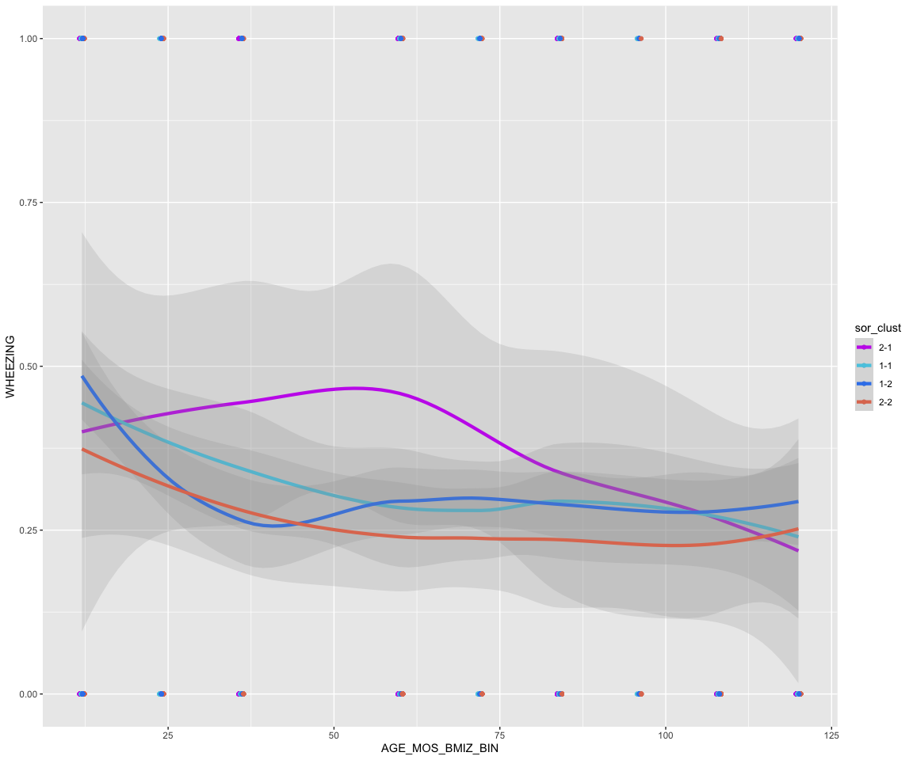

``` r
# plot ECZEMA
tab_model(m2)
```

<table style="border-collapse:collapse; border:none;">
<tr>
<th style="border-top: double; text-align:center; font-style:normal; font-weight:bold; padding:0.2cm;  text-align:left; ">
 
</th>
<th colspan="3" style="border-top: double; text-align:center; font-style:normal; font-weight:bold; padding:0.2cm; ">
ECZEMA
</th>
</tr>
<tr>
<td style=" text-align:center; border-bottom:1px solid; font-style:italic; font-weight:normal;  text-align:left; ">
Predictors
</td>
<td style=" text-align:center; border-bottom:1px solid; font-style:italic; font-weight:normal;  ">
Odds Ratios
</td>
<td style=" text-align:center; border-bottom:1px solid; font-style:italic; font-weight:normal;  ">
CI
</td>
<td style=" text-align:center; border-bottom:1px solid; font-style:italic; font-weight:normal;  ">
p
</td>
</tr>
<tr>
<td style=" padding:0.2cm; text-align:left; vertical-align:top; text-align:left; ">
(Intercept)
</td>
<td style=" padding:0.2cm; text-align:left; vertical-align:top; text-align:center;  ">
0.73
</td>
<td style=" padding:0.2cm; text-align:left; vertical-align:top; text-align:center;  ">
0.22 – 2.45
</td>
<td style=" padding:0.2cm; text-align:left; vertical-align:top; text-align:center;  ">
0.613
</td>
</tr>
<tr>
<td style=" padding:0.2cm; text-align:left; vertical-align:top; text-align:left; ">
sor_clust1-1
</td>
<td style=" padding:0.2cm; text-align:left; vertical-align:top; text-align:center;  ">
1.06
</td>
<td style=" padding:0.2cm; text-align:left; vertical-align:top; text-align:center;  ">
0.35 – 3.21
</td>
<td style=" padding:0.2cm; text-align:left; vertical-align:top; text-align:center;  ">
0.920
</td>
</tr>
<tr>
<td style=" padding:0.2cm; text-align:left; vertical-align:top; text-align:left; ">
sor_clust1-2
</td>
<td style=" padding:0.2cm; text-align:left; vertical-align:top; text-align:center;  ">
1.74
</td>
<td style=" padding:0.2cm; text-align:left; vertical-align:top; text-align:center;  ">
0.60 – 5.04
</td>
<td style=" padding:0.2cm; text-align:left; vertical-align:top; text-align:center;  ">
0.306
</td>
</tr>
<tr>
<td style=" padding:0.2cm; text-align:left; vertical-align:top; text-align:left; ">
sor_clust2-2
</td>
<td style=" padding:0.2cm; text-align:left; vertical-align:top; text-align:center;  ">
1.78
</td>
<td style=" padding:0.2cm; text-align:left; vertical-align:top; text-align:center;  ">
0.57 – 5.62
</td>
<td style=" padding:0.2cm; text-align:left; vertical-align:top; text-align:center;  ">
0.324
</td>
</tr>
<tr>
<td style=" padding:0.2cm; text-align:left; vertical-align:top; text-align:left; ">
AGE MOS BMIZ BIN
</td>
<td style=" padding:0.2cm; text-align:left; vertical-align:top; text-align:center;  ">
0.96
</td>
<td style=" padding:0.2cm; text-align:left; vertical-align:top; text-align:center;  ">
0.93 – 0.98
</td>
<td style=" padding:0.2cm; text-align:left; vertical-align:top; text-align:center;  ">
<strong>\<0.001</strong>
</td>
</tr>
<tr>
<td colspan="4" style="font-weight:bold; text-align:left; padding-top:.8em;">
Random Effects
</td>
</tr>
<tr>
<td style=" padding:0.2cm; text-align:left; vertical-align:top; text-align:left; padding-top:0.1cm; padding-bottom:0.1cm;">
σ<sup>2</sup>
</td>
<td style=" padding:0.2cm; text-align:left; vertical-align:top; padding-top:0.1cm; padding-bottom:0.1cm; text-align:left;" colspan="3">
3.29
</td>
</tr>
<tr>
<td style=" padding:0.2cm; text-align:left; vertical-align:top; text-align:left; padding-top:0.1cm; padding-bottom:0.1cm;">
τ<sub>00</sub> <sub>SUBJID</sub>
</td>
<td style=" padding:0.2cm; text-align:left; vertical-align:top; padding-top:0.1cm; padding-bottom:0.1cm; text-align:left;" colspan="3">
1.76
</td>
<tr>
<td style=" padding:0.2cm; text-align:left; vertical-align:top; text-align:left; padding-top:0.1cm; padding-bottom:0.1cm;">
τ<sub>11</sub> <sub>SUBJID.AGE_MOS_BMIZ_BIN</sub>
</td>
<td style=" padding:0.2cm; text-align:left; vertical-align:top; padding-top:0.1cm; padding-bottom:0.1cm; text-align:left;" colspan="3">
0.00
</td>
<tr>
<td style=" padding:0.2cm; text-align:left; vertical-align:top; text-align:left; padding-top:0.1cm; padding-bottom:0.1cm;">
ρ<sub>01</sub> <sub>SUBJID</sub>
</td>
<td style=" padding:0.2cm; text-align:left; vertical-align:top; padding-top:0.1cm; padding-bottom:0.1cm; text-align:left;" colspan="3">
-0.25
</td>
<tr>
<td style=" padding:0.2cm; text-align:left; vertical-align:top; text-align:left; padding-top:0.1cm; padding-bottom:0.1cm;">
ICC
</td>
<td style=" padding:0.2cm; text-align:left; vertical-align:top; padding-top:0.1cm; padding-bottom:0.1cm; text-align:left;" colspan="3">
0.64
</td>
<tr>
<td style=" padding:0.2cm; text-align:left; vertical-align:top; text-align:left; padding-top:0.1cm; padding-bottom:0.1cm;">
N <sub>SUBJID</sub>
</td>
<td style=" padding:0.2cm; text-align:left; vertical-align:top; padding-top:0.1cm; padding-bottom:0.1cm; text-align:left;" colspan="3">
700
</td>
<tr>
<td style=" padding:0.2cm; text-align:left; vertical-align:top; text-align:left; padding-top:0.1cm; padding-bottom:0.1cm; border-top:1px solid;">
Observations
</td>
<td style=" padding:0.2cm; text-align:left; vertical-align:top; padding-top:0.1cm; padding-bottom:0.1cm; text-align:left; border-top:1px solid;" colspan="3">
1559
</td>
</tr>
<tr>
<td style=" padding:0.2cm; text-align:left; vertical-align:top; text-align:left; padding-top:0.1cm; padding-bottom:0.1cm;">
Marginal R<sup>2</sup> / Conditional R<sup>2</sup>
</td>
<td style=" padding:0.2cm; text-align:left; vertical-align:top; padding-top:0.1cm; padding-bottom:0.1cm; text-align:left;" colspan="3">
0.132 / 0.689
</td>
</tr>
</table>

``` r
ggplot(sam_reps, aes(x=AGE_MOS_BMIZ_BIN, y=ECZEMA, color=sor_clust, group=sor_clust))+
  geom_point(position=position_dodge(width = 0.90))+
  stat_smooth(method="loess", size=1.5, alpha=0.2) +
  scale_color_manual(values=clust_cols)
```

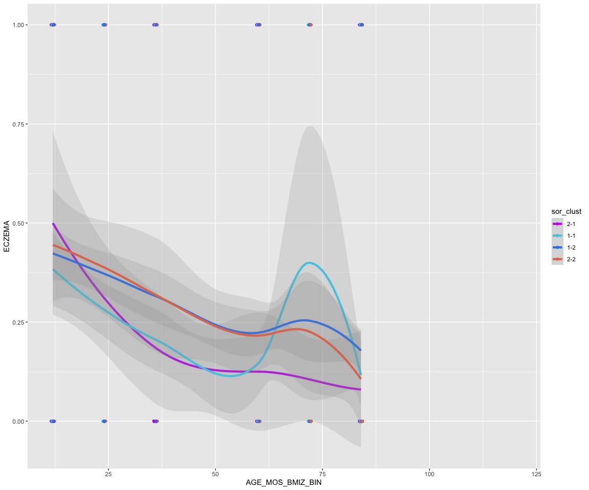

``` r
# plot BMIZ
tab_model(m3)
```

<table style="border-collapse:collapse; border:none;">
<tr>
<th style="border-top: double; text-align:center; font-style:normal; font-weight:bold; padding:0.2cm;  text-align:left; ">
 
</th>
<th colspan="3" style="border-top: double; text-align:center; font-style:normal; font-weight:bold; padding:0.2cm; ">
BMIZ
</th>
</tr>
<tr>
<td style=" text-align:center; border-bottom:1px solid; font-style:italic; font-weight:normal;  text-align:left; ">
Predictors
</td>
<td style=" text-align:center; border-bottom:1px solid; font-style:italic; font-weight:normal;  ">
Estimates
</td>
<td style=" text-align:center; border-bottom:1px solid; font-style:italic; font-weight:normal;  ">
CI
</td>
<td style=" text-align:center; border-bottom:1px solid; font-style:italic; font-weight:normal;  ">
p
</td>
</tr>
<tr>
<td style=" padding:0.2cm; text-align:left; vertical-align:top; text-align:left; ">
(Intercept)
</td>
<td style=" padding:0.2cm; text-align:left; vertical-align:top; text-align:center;  ">
0.35
</td>
<td style=" padding:0.2cm; text-align:left; vertical-align:top; text-align:center;  ">
-0.05 – 0.75
</td>
<td style=" padding:0.2cm; text-align:left; vertical-align:top; text-align:center;  ">
0.088
</td>
</tr>
<tr>
<td style=" padding:0.2cm; text-align:left; vertical-align:top; text-align:left; ">
sor_clust1-1
</td>
<td style=" padding:0.2cm; text-align:left; vertical-align:top; text-align:center;  ">
-0.06
</td>
<td style=" padding:0.2cm; text-align:left; vertical-align:top; text-align:center;  ">
-0.50 – 0.37
</td>
<td style=" padding:0.2cm; text-align:left; vertical-align:top; text-align:center;  ">
0.770
</td>
</tr>
<tr>
<td style=" padding:0.2cm; text-align:left; vertical-align:top; text-align:left; ">
sor_clust1-2
</td>
<td style=" padding:0.2cm; text-align:left; vertical-align:top; text-align:center;  ">
-0.23
</td>
<td style=" padding:0.2cm; text-align:left; vertical-align:top; text-align:center;  ">
-0.63 – 0.18
</td>
<td style=" padding:0.2cm; text-align:left; vertical-align:top; text-align:center;  ">
0.274
</td>
</tr>
<tr>
<td style=" padding:0.2cm; text-align:left; vertical-align:top; text-align:left; ">
sor_clust2-2
</td>
<td style=" padding:0.2cm; text-align:left; vertical-align:top; text-align:center;  ">
-0.15
</td>
<td style=" padding:0.2cm; text-align:left; vertical-align:top; text-align:center;  ">
-0.59 – 0.29
</td>
<td style=" padding:0.2cm; text-align:left; vertical-align:top; text-align:center;  ">
0.498
</td>
</tr>
<tr>
<td style=" padding:0.2cm; text-align:left; vertical-align:top; text-align:left; ">
AGE MOS BMIZ BIN
</td>
<td style=" padding:0.2cm; text-align:left; vertical-align:top; text-align:center;  ">
0.00
</td>
<td style=" padding:0.2cm; text-align:left; vertical-align:top; text-align:center;  ">
0.00 – 0.01
</td>
<td style=" padding:0.2cm; text-align:left; vertical-align:top; text-align:center;  ">
<strong>\<0.001</strong>
</td>
</tr>
<tr>
<td colspan="4" style="font-weight:bold; text-align:left; padding-top:.8em;">
Random Effects
</td>
</tr>
<tr>
<td style=" padding:0.2cm; text-align:left; vertical-align:top; text-align:left; padding-top:0.1cm; padding-bottom:0.1cm;">
σ<sup>2</sup>
</td>
<td style=" padding:0.2cm; text-align:left; vertical-align:top; padding-top:0.1cm; padding-bottom:0.1cm; text-align:left;" colspan="3">
0.13
</td>
</tr>
<tr>
<td style=" padding:0.2cm; text-align:left; vertical-align:top; text-align:left; padding-top:0.1cm; padding-bottom:0.1cm;">
τ<sub>00</sub> <sub>SUBJID</sub>
</td>
<td style=" padding:0.2cm; text-align:left; vertical-align:top; padding-top:0.1cm; padding-bottom:0.1cm; text-align:left;" colspan="3">
1.92
</td>
<tr>
<td style=" padding:0.2cm; text-align:left; vertical-align:top; text-align:left; padding-top:0.1cm; padding-bottom:0.1cm;">
τ<sub>11</sub> <sub>SUBJID.AGE_MOS_BMIZ_BIN</sub>
</td>
<td style=" padding:0.2cm; text-align:left; vertical-align:top; padding-top:0.1cm; padding-bottom:0.1cm; text-align:left;" colspan="3">
0.00
</td>
<tr>
<td style=" padding:0.2cm; text-align:left; vertical-align:top; text-align:left; padding-top:0.1cm; padding-bottom:0.1cm;">
ρ<sub>01</sub> <sub>SUBJID</sub>
</td>
<td style=" padding:0.2cm; text-align:left; vertical-align:top; padding-top:0.1cm; padding-bottom:0.1cm; text-align:left;" colspan="3">
-0.63
</td>
<tr>
<td style=" padding:0.2cm; text-align:left; vertical-align:top; text-align:left; padding-top:0.1cm; padding-bottom:0.1cm;">
ICC
</td>
<td style=" padding:0.2cm; text-align:left; vertical-align:top; padding-top:0.1cm; padding-bottom:0.1cm; text-align:left;" colspan="3">
0.91
</td>
<tr>
<td style=" padding:0.2cm; text-align:left; vertical-align:top; text-align:left; padding-top:0.1cm; padding-bottom:0.1cm;">
N <sub>SUBJID</sub>
</td>
<td style=" padding:0.2cm; text-align:left; vertical-align:top; padding-top:0.1cm; padding-bottom:0.1cm; text-align:left;" colspan="3">
657
</td>
<tr>
<td style=" padding:0.2cm; text-align:left; vertical-align:top; text-align:left; padding-top:0.1cm; padding-bottom:0.1cm; border-top:1px solid;">
Observations
</td>
<td style=" padding:0.2cm; text-align:left; vertical-align:top; padding-top:0.1cm; padding-bottom:0.1cm; text-align:left; border-top:1px solid;" colspan="3">
1750
</td>
</tr>
<tr>
<td style=" padding:0.2cm; text-align:left; vertical-align:top; text-align:left; padding-top:0.1cm; padding-bottom:0.1cm;">
Marginal R<sup>2</sup> / Conditional R<sup>2</sup>
</td>
<td style=" padding:0.2cm; text-align:left; vertical-align:top; padding-top:0.1cm; padding-bottom:0.1cm; text-align:left;" colspan="3">
0.019 / 0.909
</td>
</tr>
</table>

``` r
ggplot(sam_reps, aes(x=AGE_MOS_BMIZ_BIN, y=BMIZ, color=sor_clust, group=sor_clust))+
  geom_point(position=position_dodge(width = 0.90))+
  stat_smooth(method="loess", size=1.5, alpha=0.2) +
  scale_color_manual(values=clust_cols)
```

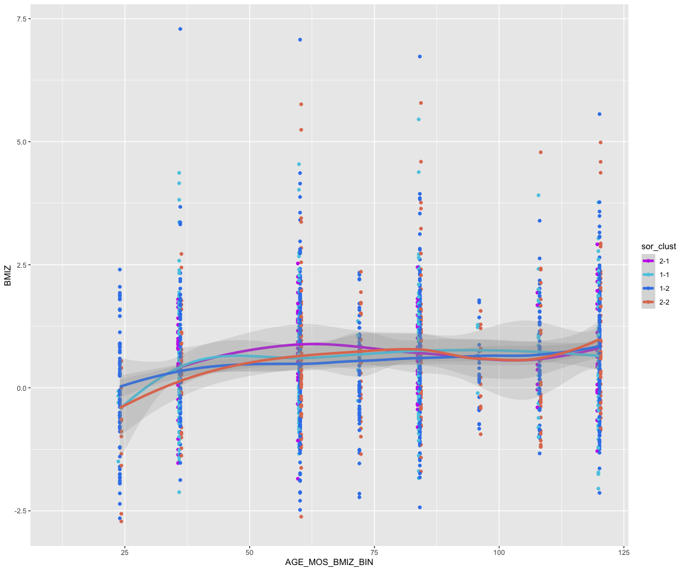

``` r
# plot log_TIGE
tab_model(m4)
```

<table style="border-collapse:collapse; border:none;">
<tr>
<th style="border-top: double; text-align:center; font-style:normal; font-weight:bold; padding:0.2cm;  text-align:left; ">
 
</th>
<th colspan="3" style="border-top: double; text-align:center; font-style:normal; font-weight:bold; padding:0.2cm; ">
log TIGE
</th>
</tr>
<tr>
<td style=" text-align:center; border-bottom:1px solid; font-style:italic; font-weight:normal;  text-align:left; ">
Predictors
</td>
<td style=" text-align:center; border-bottom:1px solid; font-style:italic; font-weight:normal;  ">
Estimates
</td>
<td style=" text-align:center; border-bottom:1px solid; font-style:italic; font-weight:normal;  ">
CI
</td>
<td style=" text-align:center; border-bottom:1px solid; font-style:italic; font-weight:normal;  ">
p
</td>
</tr>
<tr>
<td style=" padding:0.2cm; text-align:left; vertical-align:top; text-align:left; ">
(Intercept)
</td>
<td style=" padding:0.2cm; text-align:left; vertical-align:top; text-align:center;  ">
3.70
</td>
<td style=" padding:0.2cm; text-align:left; vertical-align:top; text-align:center;  ">
3.24 – 4.16
</td>
<td style=" padding:0.2cm; text-align:left; vertical-align:top; text-align:center;  ">
<strong>\<0.001</strong>
</td>
</tr>
<tr>
<td style=" padding:0.2cm; text-align:left; vertical-align:top; text-align:left; ">
sor_clust1-1
</td>
<td style=" padding:0.2cm; text-align:left; vertical-align:top; text-align:center;  ">
-0.31
</td>
<td style=" padding:0.2cm; text-align:left; vertical-align:top; text-align:center;  ">
-0.82 – 0.19
</td>
<td style=" padding:0.2cm; text-align:left; vertical-align:top; text-align:center;  ">
0.222
</td>
</tr>
<tr>
<td style=" padding:0.2cm; text-align:left; vertical-align:top; text-align:left; ">
sor_clust1-2
</td>
<td style=" padding:0.2cm; text-align:left; vertical-align:top; text-align:center;  ">
-0.57
</td>
<td style=" padding:0.2cm; text-align:left; vertical-align:top; text-align:center;  ">
-1.04 – -0.10
</td>
<td style=" padding:0.2cm; text-align:left; vertical-align:top; text-align:center;  ">
<strong>0.017</strong>
</td>
</tr>
<tr>
<td style=" padding:0.2cm; text-align:left; vertical-align:top; text-align:left; ">
sor_clust2-2
</td>
<td style=" padding:0.2cm; text-align:left; vertical-align:top; text-align:center;  ">
-0.79
</td>
<td style=" padding:0.2cm; text-align:left; vertical-align:top; text-align:center;  ">
-1.30 – -0.28
</td>
<td style=" padding:0.2cm; text-align:left; vertical-align:top; text-align:center;  ">
<strong>0.002</strong>
</td>
</tr>
<tr>
<td style=" padding:0.2cm; text-align:left; vertical-align:top; text-align:left; ">
AGE MOS BMIZ BIN
</td>
<td style=" padding:0.2cm; text-align:left; vertical-align:top; text-align:center;  ">
0.01
</td>
<td style=" padding:0.2cm; text-align:left; vertical-align:top; text-align:center;  ">
0.01 – 0.01
</td>
<td style=" padding:0.2cm; text-align:left; vertical-align:top; text-align:center;  ">
<strong>\<0.001</strong>
</td>
</tr>
<tr>
<td colspan="4" style="font-weight:bold; text-align:left; padding-top:.8em;">
Random Effects
</td>
</tr>
<tr>
<td style=" padding:0.2cm; text-align:left; vertical-align:top; text-align:left; padding-top:0.1cm; padding-bottom:0.1cm;">
σ<sup>2</sup>
</td>
<td style=" padding:0.2cm; text-align:left; vertical-align:top; padding-top:0.1cm; padding-bottom:0.1cm; text-align:left;" colspan="3">
0.45
</td>
</tr>
<tr>
<td style=" padding:0.2cm; text-align:left; vertical-align:top; text-align:left; padding-top:0.1cm; padding-bottom:0.1cm;">
τ<sub>00</sub> <sub>SUBJID</sub>
</td>
<td style=" padding:0.2cm; text-align:left; vertical-align:top; padding-top:0.1cm; padding-bottom:0.1cm; text-align:left;" colspan="3">
1.54
</td>
<tr>
<td style=" padding:0.2cm; text-align:left; vertical-align:top; text-align:left; padding-top:0.1cm; padding-bottom:0.1cm;">
τ<sub>11</sub> <sub>SUBJID.AGE_MOS_BMIZ_BIN</sub>
</td>
<td style=" padding:0.2cm; text-align:left; vertical-align:top; padding-top:0.1cm; padding-bottom:0.1cm; text-align:left;" colspan="3">
0.00
</td>
<tr>
<td style=" padding:0.2cm; text-align:left; vertical-align:top; text-align:left; padding-top:0.1cm; padding-bottom:0.1cm;">
ρ<sub>01</sub> <sub>SUBJID</sub>
</td>
<td style=" padding:0.2cm; text-align:left; vertical-align:top; padding-top:0.1cm; padding-bottom:0.1cm; text-align:left;" colspan="3">
-0.27
</td>
<tr>
<td style=" padding:0.2cm; text-align:left; vertical-align:top; text-align:left; padding-top:0.1cm; padding-bottom:0.1cm;">
ICC
</td>
<td style=" padding:0.2cm; text-align:left; vertical-align:top; padding-top:0.1cm; padding-bottom:0.1cm; text-align:left;" colspan="3">
0.78
</td>
<tr>
<td style=" padding:0.2cm; text-align:left; vertical-align:top; text-align:left; padding-top:0.1cm; padding-bottom:0.1cm;">
N <sub>SUBJID</sub>
</td>
<td style=" padding:0.2cm; text-align:left; vertical-align:top; padding-top:0.1cm; padding-bottom:0.1cm; text-align:left;" colspan="3">
695
</td>
<tr>
<td style=" padding:0.2cm; text-align:left; vertical-align:top; text-align:left; padding-top:0.1cm; padding-bottom:0.1cm; border-top:1px solid;">
Observations
</td>
<td style=" padding:0.2cm; text-align:left; vertical-align:top; padding-top:0.1cm; padding-bottom:0.1cm; text-align:left; border-top:1px solid;" colspan="3">
1814
</td>
</tr>
<tr>
<td style=" padding:0.2cm; text-align:left; vertical-align:top; text-align:left; padding-top:0.1cm; padding-bottom:0.1cm;">
Marginal R<sup>2</sup> / Conditional R<sup>2</sup>
</td>
<td style=" padding:0.2cm; text-align:left; vertical-align:top; padding-top:0.1cm; padding-bottom:0.1cm; text-align:left;" colspan="3">
0.104 / 0.805
</td>
</tr>
</table>

``` r
ggplot(sam_reps, aes(x=AGE_MOS_BMIZ_BIN, y=log_TIGE, color=sor_clust, group=sor_clust))+
  geom_point(position=position_dodge(width = 0.90))+
  stat_smooth(method="loess", size=1.5, alpha=0.2) +
  scale_color_manual(values=clust_cols)
```

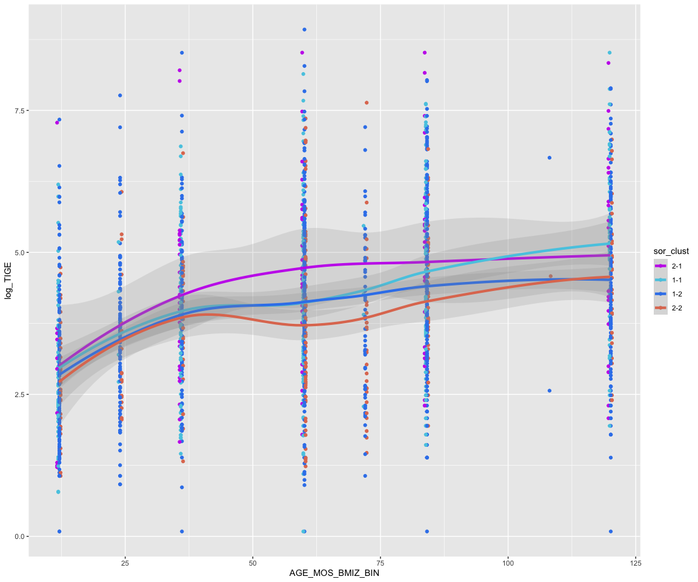

## 2.7 Cox regression of asthma acquisition over time

The last, and arguably most important, variable we’re going to look at
is what I’ve called “asthma_def_recalc”. See, we were given
“asthma_def_1” and “asthma_def_2”, which are essentially both fixed
measures indicating whether each person has reported a physician
diagnosis of asthma ever. Potentially interesting? Yes. But I feel we
can do better.

In an attempt to create a variable with more granularity than “asthma
ever”, I took the date of asthma report, converted that to an age, and
created a new longitudinal variable for each participant where
collection time points before the age of asthma report get a 0, and time
points after get a 1; in cases where they never develop asthma they will
have all 0 values across all sample time points.

Now, if you’re like me, you thought “of nice, this asthma_def_recalc can
be used in a logistic regression to model asthma over time”. I think I
was very wrong about this assumption since the acquisition of asthma
over time isn’t an independent event; there is a specific time point
after which all 0’s switch to 1’s. This data modality describes a
survival curve, so that’s the framework we should be working in. I won’t
go into details here, but check this resource for more info
<https://stats.oarc.ucla.edu/wp-content/uploads/2025/02/survival_r_full.html>

Note that we’re reading in a different dataset than we’ve been using up
to now. This new data takes advantage of the fact that we no longer need
the microbiome data for analysis; we’ve already used the data to
calculate microbiome trajectories, so we can merge back to the full set
of metadata and use those information regardless of extant microbime
measurements. I did not do this for the models above because they crash
due to memory limitations, but you can (and should) run the full set of
metadata on wynton.

``` r
sam<-read.csv("/Users/ksugino/Library/CloudStorage/Box-Box/general_analysis_scripts/LCGA_LAMB_example/asthma_def_recalc_data.csv")

# subset data to useful columns
df<-sam[,c("AGE_MOS_BMIZ_BIN","asthma_def_recalc","sor_clust", "SUBJID")]
# remake sor clust names and such
colnames(df)<-c("age","asthma","Trajectory","id")
df$Trajectory<-factor(df$Trajectory, labels=c("I","II","III","IV"))

# resturcture data so we keep only the earliest time to event=1 or the last time to event=0
surv_df<-df %>%
  group_by(id) %>%
  slice(
    if(any(asthma == 1)) {
      which.min(ifelse(asthma == 1, age, Inf))
    } else{
      which.max(age)
    }
  ) %>%
  ungroup()


a<-coxph(Surv(age, asthma) ~ Trajectory 
         , data = surv_df)
a |> 
  tbl_regression(exp = TRUE) 
```

<div id="lredwyqstk" style="padding-left:0px;padding-right:0px;padding-top:10px;padding-bottom:10px;overflow-x:auto;overflow-y:auto;width:auto;height:auto;">
<style>#lredwyqstk table {
  font-family: system-ui, 'Segoe UI', Roboto, Helvetica, Arial, sans-serif, 'Apple Color Emoji', 'Segoe UI Emoji', 'Segoe UI Symbol', 'Noto Color Emoji';
  -webkit-font-smoothing: antialiased;
  -moz-osx-font-smoothing: grayscale;
}

#lredwyqstk thead, #lredwyqstk tbody, #lredwyqstk tfoot, #lredwyqstk tr, #lredwyqstk td, #lredwyqstk th {
  border-style: none;
}

#lredwyqstk p {
  margin: 0;
  padding: 0;
}

#lredwyqstk .gt_table {
  display: table;
  border-collapse: collapse;
  line-height: normal;
  margin-left: auto;
  margin-right: auto;
  color: #333333;
  font-size: 16px;
  font-weight: normal;
  font-style: normal;
  background-color: #FFFFFF;
  width: auto;
  border-top-style: solid;
  border-top-width: 2px;
  border-top-color: #A8A8A8;
  border-right-style: none;
  border-right-width: 2px;
  border-right-color: #D3D3D3;
  border-bottom-style: solid;
  border-bottom-width: 2px;
  border-bottom-color: #A8A8A8;
  border-left-style: none;
  border-left-width: 2px;
  border-left-color: #D3D3D3;
}

#lredwyqstk .gt_caption {
  padding-top: 4px;
  padding-bottom: 4px;
}

#lredwyqstk .gt_title {
  color: #333333;
  font-size: 125%;
  font-weight: initial;
  padding-top: 4px;
  padding-bottom: 4px;
  padding-left: 5px;
  padding-right: 5px;
  border-bottom-color: #FFFFFF;
  border-bottom-width: 0;
}

#lredwyqstk .gt_subtitle {
  color: #333333;
  font-size: 85%;
  font-weight: initial;
  padding-top: 3px;
  padding-bottom: 5px;
  padding-left: 5px;
  padding-right: 5px;
  border-top-color: #FFFFFF;
  border-top-width: 0;
}

#lredwyqstk .gt_heading {
  background-color: #FFFFFF;
  text-align: center;
  border-bottom-color: #FFFFFF;
  border-left-style: none;
  border-left-width: 1px;
  border-left-color: #D3D3D3;
  border-right-style: none;
  border-right-width: 1px;
  border-right-color: #D3D3D3;
}

#lredwyqstk .gt_bottom_border {
  border-bottom-style: solid;
  border-bottom-width: 2px;
  border-bottom-color: #D3D3D3;
}

#lredwyqstk .gt_col_headings {
  border-top-style: solid;
  border-top-width: 2px;
  border-top-color: #D3D3D3;
  border-bottom-style: solid;
  border-bottom-width: 2px;
  border-bottom-color: #D3D3D3;
  border-left-style: none;
  border-left-width: 1px;
  border-left-color: #D3D3D3;
  border-right-style: none;
  border-right-width: 1px;
  border-right-color: #D3D3D3;
}

#lredwyqstk .gt_col_heading {
  color: #333333;
  background-color: #FFFFFF;
  font-size: 100%;
  font-weight: normal;
  text-transform: inherit;
  border-left-style: none;
  border-left-width: 1px;
  border-left-color: #D3D3D3;
  border-right-style: none;
  border-right-width: 1px;
  border-right-color: #D3D3D3;
  vertical-align: bottom;
  padding-top: 5px;
  padding-bottom: 6px;
  padding-left: 5px;
  padding-right: 5px;
  overflow-x: hidden;
}

#lredwyqstk .gt_column_spanner_outer {
  color: #333333;
  background-color: #FFFFFF;
  font-size: 100%;
  font-weight: normal;
  text-transform: inherit;
  padding-top: 0;
  padding-bottom: 0;
  padding-left: 4px;
  padding-right: 4px;
}

#lredwyqstk .gt_column_spanner_outer:first-child {
  padding-left: 0;
}

#lredwyqstk .gt_column_spanner_outer:last-child {
  padding-right: 0;
}

#lredwyqstk .gt_column_spanner {
  border-bottom-style: solid;
  border-bottom-width: 2px;
  border-bottom-color: #D3D3D3;
  vertical-align: bottom;
  padding-top: 5px;
  padding-bottom: 5px;
  overflow-x: hidden;
  display: inline-block;
  width: 100%;
}

#lredwyqstk .gt_spanner_row {
  border-bottom-style: hidden;
}

#lredwyqstk .gt_group_heading {
  padding-top: 8px;
  padding-bottom: 8px;
  padding-left: 5px;
  padding-right: 5px;
  color: #333333;
  background-color: #FFFFFF;
  font-size: 100%;
  font-weight: initial;
  text-transform: inherit;
  border-top-style: solid;
  border-top-width: 2px;
  border-top-color: #D3D3D3;
  border-bottom-style: solid;
  border-bottom-width: 2px;
  border-bottom-color: #D3D3D3;
  border-left-style: none;
  border-left-width: 1px;
  border-left-color: #D3D3D3;
  border-right-style: none;
  border-right-width: 1px;
  border-right-color: #D3D3D3;
  vertical-align: middle;
  text-align: left;
}

#lredwyqstk .gt_empty_group_heading {
  padding: 0.5px;
  color: #333333;
  background-color: #FFFFFF;
  font-size: 100%;
  font-weight: initial;
  border-top-style: solid;
  border-top-width: 2px;
  border-top-color: #D3D3D3;
  border-bottom-style: solid;
  border-bottom-width: 2px;
  border-bottom-color: #D3D3D3;
  vertical-align: middle;
}

#lredwyqstk .gt_from_md > :first-child {
  margin-top: 0;
}

#lredwyqstk .gt_from_md > :last-child {
  margin-bottom: 0;
}

#lredwyqstk .gt_row {
  padding-top: 8px;
  padding-bottom: 8px;
  padding-left: 5px;
  padding-right: 5px;
  margin: 10px;
  border-top-style: solid;
  border-top-width: 1px;
  border-top-color: #D3D3D3;
  border-left-style: none;
  border-left-width: 1px;
  border-left-color: #D3D3D3;
  border-right-style: none;
  border-right-width: 1px;
  border-right-color: #D3D3D3;
  vertical-align: middle;
  overflow-x: hidden;
}

#lredwyqstk .gt_stub {
  color: #333333;
  background-color: #FFFFFF;
  font-size: 100%;
  font-weight: initial;
  text-transform: inherit;
  border-right-style: solid;
  border-right-width: 2px;
  border-right-color: #D3D3D3;
  padding-left: 5px;
  padding-right: 5px;
}

#lredwyqstk .gt_stub_row_group {
  color: #333333;
  background-color: #FFFFFF;
  font-size: 100%;
  font-weight: initial;
  text-transform: inherit;
  border-right-style: solid;
  border-right-width: 2px;
  border-right-color: #D3D3D3;
  padding-left: 5px;
  padding-right: 5px;
  vertical-align: top;
}

#lredwyqstk .gt_row_group_first td {
  border-top-width: 2px;
}

#lredwyqstk .gt_row_group_first th {
  border-top-width: 2px;
}

#lredwyqstk .gt_summary_row {
  color: #333333;
  background-color: #FFFFFF;
  text-transform: inherit;
  padding-top: 8px;
  padding-bottom: 8px;
  padding-left: 5px;
  padding-right: 5px;
}

#lredwyqstk .gt_first_summary_row {
  border-top-style: solid;
  border-top-color: #D3D3D3;
}

#lredwyqstk .gt_first_summary_row.thick {
  border-top-width: 2px;
}

#lredwyqstk .gt_last_summary_row {
  padding-top: 8px;
  padding-bottom: 8px;
  padding-left: 5px;
  padding-right: 5px;
  border-bottom-style: solid;
  border-bottom-width: 2px;
  border-bottom-color: #D3D3D3;
}

#lredwyqstk .gt_grand_summary_row {
  color: #333333;
  background-color: #FFFFFF;
  text-transform: inherit;
  padding-top: 8px;
  padding-bottom: 8px;
  padding-left: 5px;
  padding-right: 5px;
}

#lredwyqstk .gt_first_grand_summary_row {
  padding-top: 8px;
  padding-bottom: 8px;
  padding-left: 5px;
  padding-right: 5px;
  border-top-style: double;
  border-top-width: 6px;
  border-top-color: #D3D3D3;
}

#lredwyqstk .gt_last_grand_summary_row_top {
  padding-top: 8px;
  padding-bottom: 8px;
  padding-left: 5px;
  padding-right: 5px;
  border-bottom-style: double;
  border-bottom-width: 6px;
  border-bottom-color: #D3D3D3;
}

#lredwyqstk .gt_striped {
  background-color: rgba(128, 128, 128, 0.05);
}

#lredwyqstk .gt_table_body {
  border-top-style: solid;
  border-top-width: 2px;
  border-top-color: #D3D3D3;
  border-bottom-style: solid;
  border-bottom-width: 2px;
  border-bottom-color: #D3D3D3;
}

#lredwyqstk .gt_footnotes {
  color: #333333;
  background-color: #FFFFFF;
  border-bottom-style: none;
  border-bottom-width: 2px;
  border-bottom-color: #D3D3D3;
  border-left-style: none;
  border-left-width: 2px;
  border-left-color: #D3D3D3;
  border-right-style: none;
  border-right-width: 2px;
  border-right-color: #D3D3D3;
}

#lredwyqstk .gt_footnote {
  margin: 0px;
  font-size: 90%;
  padding-top: 4px;
  padding-bottom: 4px;
  padding-left: 5px;
  padding-right: 5px;
}

#lredwyqstk .gt_sourcenotes {
  color: #333333;
  background-color: #FFFFFF;
  border-bottom-style: none;
  border-bottom-width: 2px;
  border-bottom-color: #D3D3D3;
  border-left-style: none;
  border-left-width: 2px;
  border-left-color: #D3D3D3;
  border-right-style: none;
  border-right-width: 2px;
  border-right-color: #D3D3D3;
}

#lredwyqstk .gt_sourcenote {
  font-size: 90%;
  padding-top: 4px;
  padding-bottom: 4px;
  padding-left: 5px;
  padding-right: 5px;
}

#lredwyqstk .gt_left {
  text-align: left;
}

#lredwyqstk .gt_center {
  text-align: center;
}

#lredwyqstk .gt_right {
  text-align: right;
  font-variant-numeric: tabular-nums;
}

#lredwyqstk .gt_font_normal {
  font-weight: normal;
}

#lredwyqstk .gt_font_bold {
  font-weight: bold;
}

#lredwyqstk .gt_font_italic {
  font-style: italic;
}

#lredwyqstk .gt_super {
  font-size: 65%;
}

#lredwyqstk .gt_footnote_marks {
  font-size: 75%;
  vertical-align: 0.4em;
  position: initial;
}

#lredwyqstk .gt_asterisk {
  font-size: 100%;
  vertical-align: 0;
}

#lredwyqstk .gt_indent_1 {
  text-indent: 5px;
}

#lredwyqstk .gt_indent_2 {
  text-indent: 10px;
}

#lredwyqstk .gt_indent_3 {
  text-indent: 15px;
}

#lredwyqstk .gt_indent_4 {
  text-indent: 20px;
}

#lredwyqstk .gt_indent_5 {
  text-indent: 25px;
}

#lredwyqstk .katex-display {
  display: inline-flex !important;
  margin-bottom: 0.75em !important;
}

#lredwyqstk div.Reactable > div.rt-table > div.rt-thead > div.rt-tr.rt-tr-group-header > div.rt-th-group:after {
  height: 0px !important;
}
</style>
<table class="gt_table" data-quarto-disable-processing="false" data-quarto-bootstrap="false">
  <thead>
    <tr class="gt_col_headings">
      <th class="gt_col_heading gt_columns_bottom_border gt_left" rowspan="1" colspan="1" scope="col" id="label"><span class='gt_from_md'><strong>Characteristic</strong></span></th>
      <th class="gt_col_heading gt_columns_bottom_border gt_center" rowspan="1" colspan="1" scope="col" id="estimate"><span class='gt_from_md'><strong>HR</strong></span></th>
      <th class="gt_col_heading gt_columns_bottom_border gt_center" rowspan="1" colspan="1" scope="col" id="conf.low"><span class='gt_from_md'><strong>95% CI</strong></span></th>
      <th class="gt_col_heading gt_columns_bottom_border gt_center" rowspan="1" colspan="1" scope="col" id="p.value"><span class='gt_from_md'><strong>p-value</strong></span></th>
    </tr>
  </thead>
  <tbody class="gt_table_body">
    <tr><td headers="label" class="gt_row gt_left">Trajectory</td>
<td headers="estimate" class="gt_row gt_center"><br /></td>
<td headers="conf.low" class="gt_row gt_center"><br /></td>
<td headers="p.value" class="gt_row gt_center"><br /></td></tr>
    <tr><td headers="label" class="gt_row gt_left">    I</td>
<td headers="estimate" class="gt_row gt_center">—</td>
<td headers="conf.low" class="gt_row gt_center">—</td>
<td headers="p.value" class="gt_row gt_center"><br /></td></tr>
    <tr><td headers="label" class="gt_row gt_left">    II</td>
<td headers="estimate" class="gt_row gt_center">0.78</td>
<td headers="conf.low" class="gt_row gt_center">0.59, 1.04</td>
<td headers="p.value" class="gt_row gt_center">0.090</td></tr>
    <tr><td headers="label" class="gt_row gt_left">    III</td>
<td headers="estimate" class="gt_row gt_center">0.88</td>
<td headers="conf.low" class="gt_row gt_center">0.49, 1.56</td>
<td headers="p.value" class="gt_row gt_center">0.7</td></tr>
    <tr><td headers="label" class="gt_row gt_left">    IV</td>
<td headers="estimate" class="gt_row gt_center">0.68</td>
<td headers="conf.low" class="gt_row gt_center">0.47, 0.99</td>
<td headers="p.value" class="gt_row gt_center">0.044</td></tr>
  </tbody>
  <tfoot>
    <tr class="gt_sourcenotes">
      <td class="gt_sourcenote" colspan="4"><span class='gt_from_md'>Abbreviations: CI = Confidence Interval, HR = Hazard Ratio</span></td>
    </tr>
  </tfoot>
</table>
</div>

``` r
# compare all contrasts
emm <- emmeans(a, ~ Trajectory)
kable(pairs(emm, adjust="none"))
```

| contrast |   estimate |        SE |  df |    z.ratio |   p.value |
|:---------|-----------:|----------:|----:|-----------:|----------:|
| I - II   |  0.2483588 | 0.1465299 | Inf |  1.6949360 | 0.0900876 |
| I - III  |  0.1318345 | 0.2954724 | Inf |  0.4461820 | 0.6554658 |
| I - IV   |  0.3820442 | 0.1894290 | Inf |  2.0168204 | 0.0437143 |
| II - III | -0.1165243 | 0.2775468 | Inf | -0.4198367 | 0.6746047 |
| II - IV  |  0.1336854 | 0.1599679 | Inf |  0.8357015 | 0.4033229 |
| III - IV |  0.2502097 | 0.3023916 | Inf |  0.8274361 | 0.4079899 |

``` r
# plot asthma def
ggplot(df, aes(x=age, y=asthma, color=Trajectory, group=Trajectory))+
  geom_point(stat = "summary",position=position_dodge(width = 0.90))+
  stat_smooth(method="loess", size=1.5, alpha=0.2) +
  scale_color_manual(values=as.character(clust_cols)) +
  labs(y="Asthma acquisition over time",
       x="Age (Months)")
```

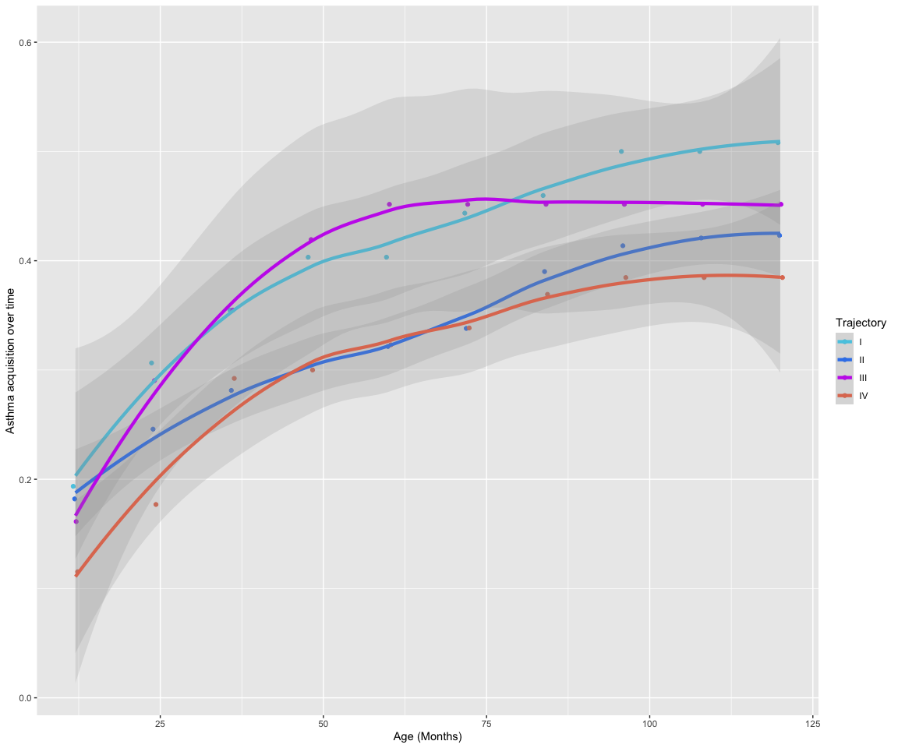

# 3 Ending Thoughts

That’s more or less the LAMB analysis thus far. I hope this was helpful
and that my functions work properly for your use cases. If not, feel
free to reach out at my gmail (which you can probably guess if you’ve
seen any of my previous university-affiliated email names). I enjoyed
making this and I hope you also find enjoyment in data and coding. To
that end, here’s some fun packages.

``` r
library("cowsay", quietly = TRUE, warn.conflicts = FALSE)
say("Q: What do you call a single buffalo?\nA: A buffalonely", by = "buffalo")
```

------------------------------------------------------------------------

| Q: What do you call a single buffalo? A: A buffalonely \> |
|----------------------------------------------------------:|
|                                                        \\ |
|                                                        \\ |

                   _.-````'-,_
         _,.,_ ,-'`           `'-.,_
       /)     (                   '``-.
      ((      ) )                      `\
        \)    (_/                        )\
        |       /)           '    ,'    / \
        `\    ^'            '     (    /  ))
          |      _/\ ,     /    ,,`\   (  "`
          \Y,   |   \  \  | ````| / \_ \
            `)_/      \  \  )    ( >  ( >
                       \( \(     |/   |/
          mic & dwb  /_(/_(    /_(  /_(

``` r
library("fortunes", quietly = TRUE, warn.conflicts = FALSE)
fortune()
```

Henrik Bengtsson: Is there a way to turn off the (annoying) beep that
occurs when one calls the locator() command and clicks the mouse? \[…\]
Brian D. Ripley: It’s a feature of the windows() device. Windows is fond
of beeping, and I just mute the sound. – Henrik Bengtsson and Brian D.
Ripley R-help (July 2001)
