-   [1 Overview](#overview)
-   [2 General Analysis Examples](#general-analysis-examples)
    -   [2.1 Population characteristics](#population-characteristics)
    -   [2.2 Stacked bar chart](#stacked-bar-chart)
    -   [2.3 Alpha diversity](#alpha-diversity)
    -   [2.4 Beta Diversity](#beta-diversity)
    -   [2.5 Differential abundance](#differential-abundance)
-   [3 Other plots](#other-plots)
    -   [3.1 Barplots: Chi-squared plot with
        count(%)](#barplots-chi-squared-plot-with-count)
    -   [3.2 Calculating stats by group within
        time](#calculating-stats-by-group-within-time)
-   [4 PCA on log-transformed
    metabolomics](#pca-on-log-transformed-metabolomics)

# 1 Overview

-   This lab very desperately needs a code base for both bioinformatic
    pipelines and downstream analysis workflows. This doc is an example
    of how I’ve written my code for general analyses that happen in this
    lab as well as examples of code that, I think, are worth documenting
    for future use or, ideally, code that will be packaged into a
    function to be used with one line of code.
-   I would love to take any functions, code chunks, or bits of utility
    you all have made and integrate them into one, cohesive, and
    (hopefully) stable set of generally useful functions to make
    analysis easier for current and future lab members.

# 2 General Analysis Examples

## 2.1 Population characteristics

-   Table 1 of most papers will show population characteristics. This is
    a method of producing something close to a publication-ready table.

<!-- -->

    ## phyloseq-class experiment-level object
    ## otu_table()   OTU Table:         [ 2237 taxa and 113 samples ]
    ## sample_data() Sample Data:       [ 113 samples by 965 sample variables ]
    ## tax_table()   Taxonomy Table:    [ 2237 taxa by 7 taxonomic ranks ]

``` r
# pull out metadata of interest
meta <- data.frame(sample_data(BEAMS_maternal_stool_metag))
# meta$mom_origins[meta$event_sample_type == "" | is.na(meta$event_sample_type)] <- NA
# meta <- meta[!is.na(meta$event_sample_type), ]
meta$mom_EPDSscore_pnq <- factor(meta$mom_EPDSscore_pnq)
meta$mom_ABO_pns <- factor(meta$mom_ABO_pns)
meta$country_pid <- factor(meta$country_pid)
# levels(meta$country_pid) <- c("MX","US")
meta$mom_ed12_pnq <- factor(meta$mom_ed12_pnq, levels = c("1. <12", "0. >=12"))
levels(meta$mom_ed12_pnq) <- c("<12 yrs","\u226512yrs")

meta$mom_ABO_pns <- factor(meta$mom_ABO_pns, levels = c("1. yes", "0. no"))
levels(meta$mom_ABO_pns) <- c("Yes","No")
meta$mom_asma_pnq    <- factor(meta$mom_asma_pnq, levels = c("1. yes", "0. no"))
levels(meta$mom_asma_pnq) <- c("Yes","No")
meta$dad_asma_pnq    <- factor(meta$dad_asma_pnq, levels = c("1. yes", "0. no"))
levels(meta$dad_asma_pnq) <- c("Yes","No")
meta$mom_everwz_pnq  <- factor(meta$mom_everwz_pnq, levels = c("1. yes", "0. no"))
levels(meta$mom_everwz_pnq) <- c("Yes","No")
meta$mom_everhf_pnq  <- factor(meta$mom_everhf_pnq, levels = c("1. yes", "0. no"))
levels(meta$mom_everhf_pnq) <- c("Yes","No")
meta$haveanimals_pnq<-factor(meta$haveanimals_pnq, levels=c("1. yes","0. no"), labels=c("Yes","No"))

meta$chld_d1ss_m69<-ifelse(meta$chld_d1ss_m69 > 0.73, "High",
                           ifelse(meta$chld_d1ss_m69 < 0.73, "Low",
                                  NA))


# mom pss
levels(meta$mom_PSSscore_pnq)<-c("Low","Moderate","High")
# mom epds 
levels(meta$mom_EPDSscore_pnq)<-c("Low","High")

label(meta$mom_asma_pnq)<-"Maternal Asthma Ever"
label(meta$dad_asma_pnq)<-"Paternal Asthma Ever"
label(meta$mom_origins) <- "Maternal Origins"
label(meta$mom_EPDSscore_pnq) <- "Edinburgh Postnatal Depression Scale Score"
label(meta$mom_ABO_pns) <- "Antibiotic Use Within Past 30 Days"
label(meta$mom_PSSscore_pnq) <- "Perceived Stress Scale Score"
label(meta$mom_smkpreg_pnq) <- "Current Smoking Status"
label(meta$mom_prepregbmi_pnq) <- "Prepregnancy BMI"
label(meta$mom_pnage_pnq) <- "Maternal Prenatal Age"
label(meta$mom_ed12_pnq) <- "Maternal Education"
label(meta$mom_asma_pnq) <- "Maternal Ever Asthma"
label(meta$dad_asma_pnq) <- "Paternal Ever Asthma"
label(meta$mom_everwz_pnq) <- "Maternal Ever Wheeze"
label(meta$mom_everhf_pnq) <- "Maternal Ever Hay Fever"
label(meta$haveanimals_pnq) <- "Has Pets"
# income >$10,000
meta$income<-ifelse(grepl("1\\.|2\\.|3\\.",meta$income_pnq),"<$10k/yr", 
                    ifelse(grepl("4\\.|5\\.|6\\.|7\\.",meta$income_pnq),"\u2265$10k/yr",
                           NA))
label(meta$income) <- "Income >10k/yr"
label(meta$mom_gravida_mrd) <- "Gravida"
label(meta$chld_d1ss_m69) <- "Infant 6-9 MO S-score"
```

``` r
pvalue <- function(x, ...) {
  # Construct vectors of data y, and groups (strata) g
  y <- unlist(x)
  g <- factor(rep(1:length(x), times=sapply(x, length)))
  if (is.numeric(y)) {
    # For numeric variables, perform a standard 2-sample t-test
    temp <- aov(y ~ g)
    p <- summary(temp)[[1]][["Pr(>F)"]][1]
  } else {
    # For categorical variables, perform a chi-squared test of independence
    p <- chisq.test(na.omit(table(y, g)))$p.value
  }
  # Format the p-value, using an HTML entity for the less-than sign.
  # The initial empty string places the output on the line below the variable label.
  c("", sub("<", "&lt;", format.pval(p, digits=4, eps=0.001)))
}

table1_obj <- table1(~ 
                       chld_d1ss_m69 + mom_EPDSscore_pnq + mom_PSSscore_pnq +
                       mom_pnage_pnq + mom_prepregbmi_pnq + income + mom_ed12_pnq + 
                       mom_gravida_mrd + mom_ABO_pns + mom_asma_pnq + 
                       dad_asma_pnq + mom_everwz_pnq + mom_everhf_pnq +
                       haveanimals_pnq
                     | country_pid,
                     data = meta,
                     overall = FALSE,
                     extra.col=list(`P-value`=pvalue),
                     caption = "Maternal Stool Population Characteristics (N = 99) ")
table1_obj
```

<div class="Rtable1"><table class="Rtable1"><caption>Maternal Stool Population Characteristics (N = 99) </caption>

<thead>
<tr>
<th class='rowlabel firstrow lastrow'></th>
<th class='firstrow lastrow'><span class='stratlabel'>1. US<br><span class='stratn'>(N=48)</span></span></th>
<th class='firstrow lastrow'><span class='stratlabel'>2. MX<br><span class='stratn'>(N=53)</span></span></th>
<th class='firstrow lastrow'><span class='stratlabel'>P-value</span></th>
</tr>
</thead>
<tbody>
<tr>
<td class='rowlabel firstrow'>Infant 6-9 MO S-score</td>
<td class='firstrow'></td>
<td class='firstrow'></td>
<td class='firstrow'></td>
</tr>
<tr>
<td class='rowlabel'>High</td>
<td>17 (35.4%)</td>
<td>6 (11.3%)</td>
<td>0.005819</td>
</tr>
<tr>
<td class='rowlabel'>Low</td>
<td>21 (43.8%)</td>
<td>36 (67.9%)</td>
<td></td>
</tr>
<tr>
<td class='rowlabel lastrow'>Missing</td>
<td class='lastrow'>10 (20.8%)</td>
<td class='lastrow'>11 (20.8%)</td>
<td class='lastrow'></td>
</tr>
<tr>
<td class='rowlabel firstrow'>Edinburgh Postnatal Depression Scale Score</td>
<td class='firstrow'></td>
<td class='firstrow'></td>
<td class='firstrow'></td>
</tr>
<tr>
<td class='rowlabel'>Low</td>
<td>43 (89.6%)</td>
<td>39 (73.6%)</td>
<td>0.02808</td>
</tr>
<tr>
<td class='rowlabel'>High</td>
<td>3 (6.3%)</td>
<td>13 (24.5%)</td>
<td></td>
</tr>
<tr>
<td class='rowlabel lastrow'>Missing</td>
<td class='lastrow'>2 (4.2%)</td>
<td class='lastrow'>1 (1.9%)</td>
<td class='lastrow'></td>
</tr>
<tr>
<td class='rowlabel firstrow'>Perceived Stress Scale Score</td>
<td class='firstrow'></td>
<td class='firstrow'></td>
<td class='firstrow'></td>
</tr>
<tr>
<td class='rowlabel'>Low</td>
<td>15 (31.3%)</td>
<td>15 (28.3%)</td>
<td>0.685</td>
</tr>
<tr>
<td class='rowlabel'>Moderate</td>
<td>27 (56.3%)</td>
<td>34 (64.2%)</td>
<td></td>
</tr>
<tr>
<td class='rowlabel'>High</td>
<td>2 (4.2%)</td>
<td>1 (1.9%)</td>
<td></td>
</tr>
<tr>
<td class='rowlabel lastrow'>Missing</td>
<td class='lastrow'>4 (8.3%)</td>
<td class='lastrow'>3 (5.7%)</td>
<td class='lastrow'></td>
</tr>
<tr>
<td class='rowlabel firstrow'>Maternal Prenatal Age</td>
<td class='firstrow'></td>
<td class='firstrow'></td>
<td class='firstrow'></td>
</tr>
<tr>
<td class='rowlabel'>Mean (SD)</td>
<td>28.9 (6.15)</td>
<td>23.3 (5.84)</td>
<td>&lt; 0.001</td>
</tr>
<tr>
<td class='rowlabel'>Median [Min, Max]</td>
<td>29.5 [18.3, 46.4]</td>
<td>22.8 [16.0, 45.9]</td>
<td></td>
</tr>
<tr>
<td class='rowlabel lastrow'>Missing</td>
<td class='lastrow'>2 (4.2%)</td>
<td class='lastrow'>0 (0%)</td>
<td class='lastrow'></td>
</tr>
<tr>
<td class='rowlabel firstrow'>Prepregnancy BMI</td>
<td class='firstrow'></td>
<td class='firstrow'></td>
<td class='firstrow'></td>
</tr>
<tr>
<td class='rowlabel'>Mean (SD)</td>
<td>30.7 (5.80)</td>
<td>24.4 (4.93)</td>
<td>&lt; 0.001</td>
</tr>
<tr>
<td class='rowlabel'>Median [Min, Max]</td>
<td>31.5 [18.8, 46.6]</td>
<td>23.5 [16.4, 41.8]</td>
<td></td>
</tr>
<tr>
<td class='rowlabel lastrow'>Missing</td>
<td class='lastrow'>4 (8.3%)</td>
<td class='lastrow'>0 (0%)</td>
<td class='lastrow'></td>
</tr>
<tr>
<td class='rowlabel firstrow'>Income >10k/yr</td>
<td class='firstrow'></td>
<td class='firstrow'></td>
<td class='firstrow'></td>
</tr>
<tr>
<td class='rowlabel'><$10k/yr</td>
<td>12 (25.0%)</td>
<td>48 (90.6%)</td>
<td>&lt; 0.001</td>
</tr>
<tr>
<td class='rowlabel'>≥$10k/yr</td>
<td>32 (66.7%)</td>
<td>1 (1.9%)</td>
<td></td>
</tr>
<tr>
<td class='rowlabel lastrow'>Missing</td>
<td class='lastrow'>4 (8.3%)</td>
<td class='lastrow'>4 (7.5%)</td>
<td class='lastrow'></td>
</tr>
<tr>
<td class='rowlabel firstrow'>Maternal Education</td>
<td class='firstrow'></td>
<td class='firstrow'></td>
<td class='firstrow'></td>
</tr>
<tr>
<td class='rowlabel'><12 yrs</td>
<td>9 (18.8%)</td>
<td>25 (47.2%)</td>
<td>0.004508</td>
</tr>
<tr>
<td class='rowlabel'>≥12yrs</td>
<td>35 (72.9%)</td>
<td>24 (45.3%)</td>
<td></td>
</tr>
<tr>
<td class='rowlabel lastrow'>Missing</td>
<td class='lastrow'>4 (8.3%)</td>
<td class='lastrow'>4 (7.5%)</td>
<td class='lastrow'></td>
</tr>
<tr>
<td class='rowlabel firstrow'>Gravida</td>
<td class='firstrow'></td>
<td class='firstrow'></td>
<td class='firstrow'></td>
</tr>
<tr>
<td class='rowlabel'>Mean (SD)</td>
<td>2.90 (1.84)</td>
<td>1.56 (0.784)</td>
<td>0.004015</td>
</tr>
<tr>
<td class='rowlabel'>Median [Min, Max]</td>
<td>3.00 [1.00, 9.00]</td>
<td>1.00 [1.00, 3.00]</td>
<td></td>
</tr>
<tr>
<td class='rowlabel lastrow'>Missing</td>
<td class='lastrow'>0 (0%)</td>
<td class='lastrow'>35 (66.0%)</td>
<td class='lastrow'></td>
</tr>
<tr>
<td class='rowlabel firstrow'>Antibiotic Use Within Past 30 Days</td>
<td class='firstrow'></td>
<td class='firstrow'></td>
<td class='firstrow'></td>
</tr>
<tr>
<td class='rowlabel'>Yes</td>
<td>0 (0%)</td>
<td>0 (0%)</td>
<td>NA</td>
</tr>
<tr>
<td class='rowlabel lastrow'>No</td>
<td class='lastrow'>48 (100%)</td>
<td class='lastrow'>53 (100%)</td>
<td class='lastrow'></td>
</tr>
<tr>
<td class='rowlabel firstrow'>Maternal Ever Asthma</td>
<td class='firstrow'></td>
<td class='firstrow'></td>
<td class='firstrow'></td>
</tr>
<tr>
<td class='rowlabel'>Yes</td>
<td>8 (16.7%)</td>
<td>5 (9.4%)</td>
<td>0.3372</td>
</tr>
<tr>
<td class='rowlabel'>No</td>
<td>36 (75.0%)</td>
<td>48 (90.6%)</td>
<td></td>
</tr>
<tr>
<td class='rowlabel lastrow'>Missing</td>
<td class='lastrow'>4 (8.3%)</td>
<td class='lastrow'>0 (0%)</td>
<td class='lastrow'></td>
</tr>
<tr>
<td class='rowlabel firstrow'>Paternal Ever Asthma</td>
<td class='firstrow'></td>
<td class='firstrow'></td>
<td class='firstrow'></td>
</tr>
<tr>
<td class='rowlabel'>Yes</td>
<td>2 (4.2%)</td>
<td>1 (1.9%)</td>
<td>0.9276</td>
</tr>
<tr>
<td class='rowlabel'>No</td>
<td>44 (91.7%)</td>
<td>50 (94.3%)</td>
<td></td>
</tr>
<tr>
<td class='rowlabel lastrow'>Missing</td>
<td class='lastrow'>2 (4.2%)</td>
<td class='lastrow'>2 (3.8%)</td>
<td class='lastrow'></td>
</tr>
<tr>
<td class='rowlabel firstrow'>Maternal Ever Wheeze</td>
<td class='firstrow'></td>
<td class='firstrow'></td>
<td class='firstrow'></td>
</tr>
<tr>
<td class='rowlabel'>Yes</td>
<td>10 (20.8%)</td>
<td>6 (11.3%)</td>
<td>0.2179</td>
</tr>
<tr>
<td class='rowlabel'>No</td>
<td>34 (70.8%)</td>
<td>47 (88.7%)</td>
<td></td>
</tr>
<tr>
<td class='rowlabel lastrow'>Missing</td>
<td class='lastrow'>4 (8.3%)</td>
<td class='lastrow'>0 (0%)</td>
<td class='lastrow'></td>
</tr>
<tr>
<td class='rowlabel firstrow'>Maternal Ever Hay Fever</td>
<td class='firstrow'></td>
<td class='firstrow'></td>
<td class='firstrow'></td>
</tr>
<tr>
<td class='rowlabel'>Yes</td>
<td>20 (41.7%)</td>
<td>8 (15.1%)</td>
<td>0.004342</td>
</tr>
<tr>
<td class='rowlabel'>No</td>
<td>23 (47.9%)</td>
<td>40 (75.5%)</td>
<td></td>
</tr>
<tr>
<td class='rowlabel lastrow'>Missing</td>
<td class='lastrow'>5 (10.4%)</td>
<td class='lastrow'>5 (9.4%)</td>
<td class='lastrow'></td>
</tr>
<tr>
<td class='rowlabel firstrow'>Has Pets</td>
<td class='firstrow'></td>
<td class='firstrow'></td>
<td class='firstrow'></td>
</tr>
<tr>
<td class='rowlabel'>Yes</td>
<td>34 (70.8%)</td>
<td>41 (77.4%)</td>
<td>0.8698</td>
</tr>
<tr>
<td class='rowlabel'>No</td>
<td>12 (25.0%)</td>
<td>12 (22.6%)</td>
<td></td>
</tr>
<tr>
<td class='rowlabel lastrow'>Missing</td>
<td class='lastrow'>2 (4.2%)</td>
<td class='lastrow'>0 (0%)</td>
<td class='lastrow'></td>
</tr>
</tbody>
</table>
</div>

## 2.2 Stacked bar chart

-   I don’t like these plots, but they’re fairly common to see in the
    field, and they can be useful for seeing outlier samples visually.
    This function let’s you plot from any taxonomic level and up to 20
    of the top taxa (the rest are shunted into other).
-   It’d be nice to have some utility linking taxa colors by phylum so
    that each genera within a phylum shares a similar color and phylum
    plots would have similar colors to the corresponding genera plots,
    but I have not gotten around to doing it.

``` r
stackedbarchart(phy = phy_rarefy, group_col = "EventType", taxlevel = "Genus", numtaxa = 20)
```

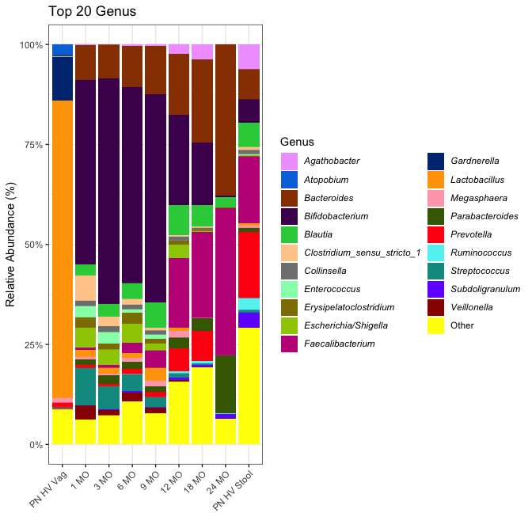

``` r
stackedbarchart(phy = phy_rarefy, group_col = "EventType", taxlevel = "Family", numtaxa = 10)
```

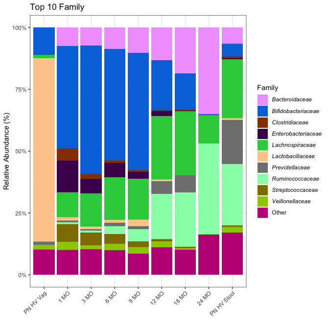

## 2.3 Alpha diversity

-   I think Katie had some version of this on the lab Github #1, but,
    like many of you, I made my own which is cool and perfect.
-   Currently handles: c(“Shannon”,“Chao1”,“Pielou”,“Faith”)
-   Statistics: Spearman, Wilcoxon, Kruskal depending on the variable
    (non-parametric)

``` r
div_mes<-c("Shannon", "Pielou", "Chao1")
vars <- c("country_pid", "chld_sex_as", 
          "mom_deliverytype_mrd", "chld_inffeed_cf1m")
caption<-"Alpha Diversity of 1-Month Infant Fecal Microbiome (Taxonomy) by Distance Metric"

# calculates alpha diversity metrics, 
phy_alpha<-alpha_div_calc(phy = phy_temp, div_mes = div_mes)
alpha_table(phy_alpha = phy_alpha, div_mes = div_mes, vars = vars, caption=caption)
```

<table class="table table-striped" style="color: black; width: auto !important; margin-left: auto; margin-right: auto;">
<caption>
Alpha Diversity of 1-Month Infant Fecal Microbiome (Taxonomy) by
Distance Metric
</caption>
<thead>
<tr>
<th style="empty-cells: hide;border-bottom:hidden;" colspan="1">
</th>
<th style="empty-cells: hide;border-bottom:hidden;" colspan="1">
</th>
<th style="border-bottom:hidden;padding-bottom:0; padding-left:3px;padding-right:3px;text-align: center; font-weight: bold; " colspan="3">

Shannon

</th>
<th style="border-bottom:hidden;padding-bottom:0; padding-left:3px;padding-right:3px;text-align: center; font-weight: bold; " colspan="3">

Pielou

</th>
<th style="border-bottom:hidden;padding-bottom:0; padding-left:3px;padding-right:3px;text-align: center; font-weight: bold; " colspan="3">

Chao1

</th>
</tr>
<tr>
<th style="text-align:left;">
variable
</th>
<th style="text-align:center;">
test
</th>
<th style="text-align:center;">
n_Shannon
</th>
<th style="text-align:center;">
statistic_Shannon
</th>
<th style="text-align:center;">
p_Shannon
</th>
<th style="text-align:center;">
n_Pielou
</th>
<th style="text-align:center;">
statistic_Pielou
</th>
<th style="text-align:center;">
p_Pielou
</th>
<th style="text-align:center;">
n_Chao1
</th>
<th style="text-align:center;">
statistic_Chao1
</th>
<th style="text-align:left;">
p_Chao1
</th>
</tr>
</thead>
<tbody>
<tr>
<td style="text-align:left;">
<span style="     color: black !important;">chld_inffeed_cf1m</span>
</td>
<td style="text-align:center;">
<span style="     color: black !important;">Kruskal</span>
</td>
<td style="text-align:center;">
<span style="     color: black !important;">118</span>
</td>
<td style="text-align:center;">
<span style="     color: black !important;">6.554</span>
</td>
<td style="text-align:center;">
<span style="     color: red !important;">0.038</span>
</td>
<td style="text-align:center;">
<span style="     color: black !important;">118</span>
</td>
<td style="text-align:center;">
<span style="     color: black !important;">3.393</span>
</td>
<td style="text-align:center;">
<span style="     color: black !important;">0.183</span>
</td>
<td style="text-align:center;">
<span style="     color: black !important;">118</span>
</td>
<td style="text-align:center;">
<span style="     color: black !important;">12.087</span>
</td>
<td style="text-align:left;">
<span style="     color: red !important;">0.002</span>
</td>
</tr>
<tr>
<td style="text-align:left;">
<span style="     color: black !important;">chld_sex_as</span>
</td>
<td style="text-align:center;">
<span style="     color: black !important;">Wilcoxon</span>
</td>
<td style="text-align:center;">
<span style="     color: black !important;">120</span>
</td>
<td style="text-align:center;">
<span style="     color: black !important;">1801</span>
</td>
<td style="text-align:center;">
<span style="     color: black !important;">0.788</span>
</td>
<td style="text-align:center;">
<span style="     color: black !important;">120</span>
</td>
<td style="text-align:center;">
<span style="     color: black !important;">1751</span>
</td>
<td style="text-align:center;">
<span style="     color: black !important;">0.998</span>
</td>
<td style="text-align:center;">
<span style="     color: black !important;">120</span>
</td>
<td style="text-align:center;">
<span style="     color: black !important;">1972.5</span>
</td>
<td style="text-align:left;">
<span style="     color: black !important;">0.237</span>
</td>
</tr>
<tr>
<td style="text-align:left;">
<span style="     color: black !important;">country_pid</span>
</td>
<td style="text-align:center;">
<span style="     color: black !important;">Wilcoxon</span>
</td>
<td style="text-align:center;">
<span style="     color: black !important;">120</span>
</td>
<td style="text-align:center;">
<span style="     color: black !important;">1519</span>
</td>
<td style="text-align:center;">
<span style="     color: black !important;">0.166</span>
</td>
<td style="text-align:center;">
<span style="     color: black !important;">120</span>
</td>
<td style="text-align:center;">
<span style="     color: black !important;">1566</span>
</td>
<td style="text-align:center;">
<span style="     color: black !important;">0.256</span>
</td>
<td style="text-align:center;">
<span style="     color: black !important;">120</span>
</td>
<td style="text-align:center;">
<span style="     color: black !important;">1351</span>
</td>
<td style="text-align:left;">
<span style="     color: red !important;">0.023</span>
</td>
</tr>
<tr>
<td style="text-align:left;">
<span style="     color: black !important;">mom_deliverytype_mrd</span>
</td>
<td style="text-align:center;">
<span style="     color: black !important;">Wilcoxon</span>
</td>
<td style="text-align:center;">
<span style="     color: black !important;">78</span>
</td>
<td style="text-align:center;">
<span style="     color: black !important;">662</span>
</td>
<td style="text-align:center;">
<span style="     color: black !important;">1</span>
</td>
<td style="text-align:center;">
<span style="     color: black !important;">78</span>
</td>
<td style="text-align:center;">
<span style="     color: black !important;">627</span>
</td>
<td style="text-align:center;">
<span style="     color: black !important;">0.708</span>
</td>
<td style="text-align:center;">
<span style="     color: black !important;">78</span>
</td>
<td style="text-align:center;">
<span style="     color: black !important;">739.5</span>
</td>
<td style="text-align:left;">
<span style="     color: black !important;">0.412</span>
</td>
</tr>
</tbody>
</table>

``` r
alpha_div_plot(phy = phy_alpha, 
               group = "country_pid",
               div_mes = c("Shannon","Pielou","Chao1"), 
               # custom_colors = vars_cols$country_pid,
               show.legend=F)
```

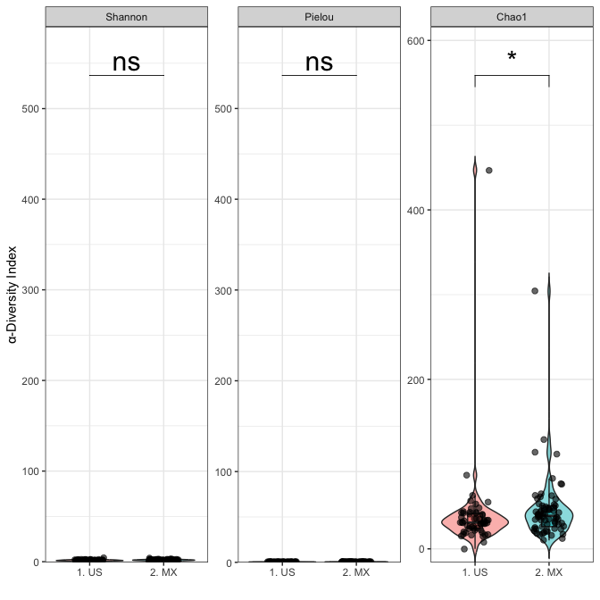

## 2.4 Beta Diversity

-   Currently handles: c(“wunifrac”,
    “unifrac”,“bray”,“sorensen”,“canberra”,“jaccard”)
-   Make sure you have a tree in your phyloseq object if you want to run
    either unifrac or canberra
-   Statistic: PERMANOVA (with adonis2)
-   Can do multiple comparisons, but the table code doesn’t work with
    this mode (yet?) so I just output in console

``` r
temp_beta <- beta_div_calc(BEAMS_1MO_Infants, c("bray", "sorensen", "jaccard"))

test_stats <- beta_div_stats(
  phy = BEAMS_1MO_Infants,
  model_vars = vars,
  dists = c("bray", "sorensen","jaccard"),
  subjectid = "family_id"
)
```

    ## [1] "Running Fixed-Effects PERMANOVA Models (cross-sectional)"
    ## country_pid
    ## 1. US 2. MX  <NA> 
    ##    54    66     0

    ## chld_sex_as
    ##   1. male 2. female      <NA> 
    ##        70        50         0

    ## mom_deliverytype_mrd
    ##   1. Vaginal 2. C-section         <NA> 
    ##           53           25           42

    ## chld_inffeed_cf1m
    ## 1. only BM  2. BM & F  3. only F       <NA> 
    ##         49         53         16          2

    ## country_pid
    ## 1. US 2. MX  <NA> 
    ##    54    66     0

    ## chld_sex_as
    ##   1. male 2. female      <NA> 
    ##        70        50         0

    ## mom_deliverytype_mrd
    ##   1. Vaginal 2. C-section         <NA> 
    ##           53           25           42

    ## chld_inffeed_cf1m
    ## 1. only BM  2. BM & F  3. only F       <NA> 
    ##         49         53         16          2

    ## country_pid
    ## 1. US 2. MX  <NA> 
    ##    54    66     0

    ## chld_sex_as
    ##   1. male 2. female      <NA> 
    ##        70        50         0

    ## mom_deliverytype_mrd
    ##   1. Vaginal 2. C-section         <NA> 
    ##           53           25           42

    ## chld_inffeed_cf1m
    ## 1. only BM  2. BM & F  3. only F       <NA> 
    ##         49         53         16          2

``` r
phy_stats <- list(temp_beta, test_stats)
# temp_beta <- phy_stats[[1]]
# test_stats <- phy_stats[[2]]

pl_country <- beta_div_plots(
  phy = BEAMS_1MO_Infants,
  beta_div = temp_beta,
  stats = test_stats,
  model_vars = c("country_pid"),
  # custom_colors = unlist(vars_cols$country_pid),
  legend_title = "MI-Origins",
  plot_title = T
)
```

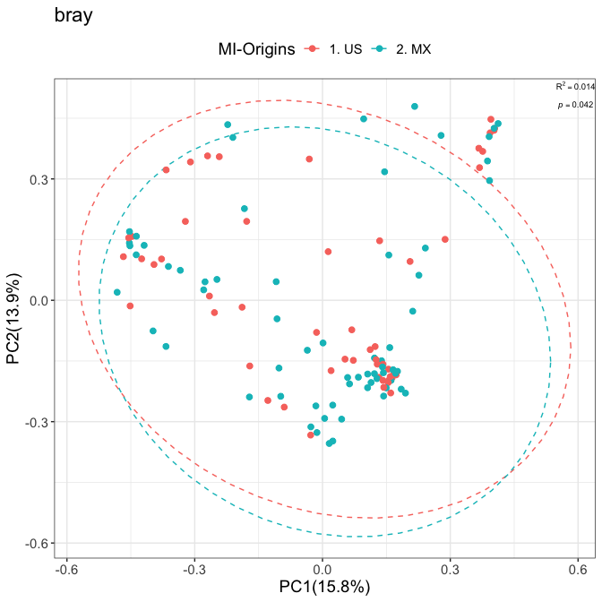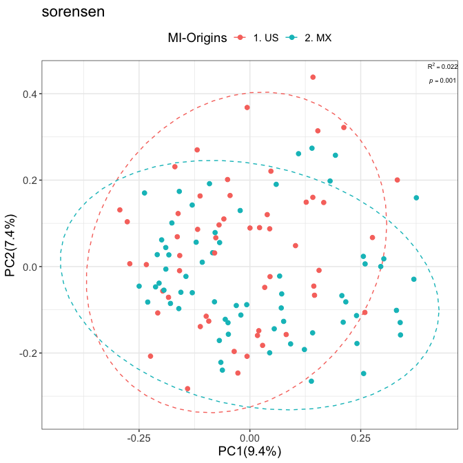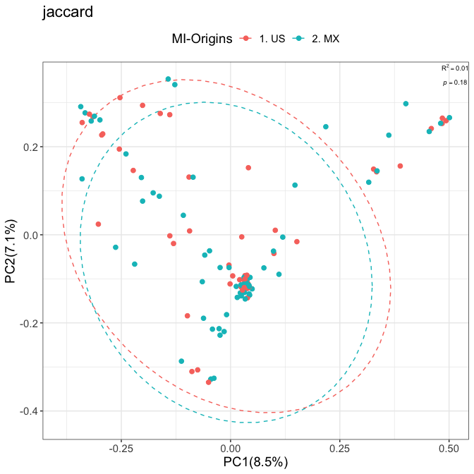

``` r
beta_div_stats_table(beta_div_stats = test_stats)
```

<table class="table table-bordered" style="color: black; width: auto !important; margin-left: auto; margin-right: auto;">
<thead>
<tr>
<th style="empty-cells: hide;border-bottom:hidden;" colspan="1">
</th>
<th style="border-bottom:hidden;padding-bottom:0; padding-left:3px;padding-right:3px;text-align: center; font-weight: bold; " colspan="2">

bray

</th>
<th style="border-bottom:hidden;padding-bottom:0; padding-left:3px;padding-right:3px;text-align: center; font-weight: bold; " colspan="2">

sorensen

</th>
<th style="border-bottom:hidden;padding-bottom:0; padding-left:3px;padding-right:3px;text-align: center; font-weight: bold; " colspan="2">

jaccard

</th>
</tr>
<tr>
<th style="text-align:left;font-weight: bold;">
vars
</th>
<th style="text-align:left;font-weight: bold;">
pval_bray
</th>
<th style="text-align:left;font-weight: bold;">
rsq_bray
</th>
<th style="text-align:left;font-weight: bold;">
pval_sorensen
</th>
<th style="text-align:left;font-weight: bold;">
rsq_sorensen
</th>
<th style="text-align:left;font-weight: bold;">
pval_jaccard
</th>
<th style="text-align:left;font-weight: bold;">
rsq_jaccard
</th>
</tr>
</thead>
<tbody>
<tr>
<td style="text-align:left;">
<span style="     color: black !important;">country_pid</span>
</td>
<td style="text-align:left;">
<span style="     color: red !important;">0.042</span>
</td>
<td style="text-align:left;">
<span style="     color: black !important;">0.0143</span>
</td>
<td style="text-align:left;">
<span style="     color: red !important;">0.001</span>
</td>
<td style="text-align:left;">
<span style="     color: black !important;">0.0216</span>
</td>
<td style="text-align:left;">
<span style="     color: black !important;">0.18</span>
</td>
<td style="text-align:left;">
<span style="     color: black !important;">0.0096</span>
</td>
</tr>
<tr>
<td style="text-align:left;">
<span style="     color: black !important;">chld_sex_as</span>
</td>
<td style="text-align:left;">
<span style="     color: red !important;">0.049</span>
</td>
<td style="text-align:left;">
<span style="     color: black !important;">0.014</span>
</td>
<td style="text-align:left;">
<span style="     color: black !important;">0.155</span>
</td>
<td style="text-align:left;">
<span style="     color: black !important;">0.0105</span>
</td>
<td style="text-align:left;">
<span style="     color: black !important;">0.085</span>
</td>
<td style="text-align:left;">
<span style="     color: black !important;">0.0105</span>
</td>
</tr>
<tr>
<td style="text-align:left;">
<span style="     color: black !important;">mom_deliverytype_mrd</span>
</td>
<td style="text-align:left;">
<span style="     color: red !important;">0.003</span>
</td>
<td style="text-align:left;">
<span style="     color: black !important;">0.033</span>
</td>
<td style="text-align:left;">
<span style="     color: red !important;">0.001</span>
</td>
<td style="text-align:left;">
<span style="     color: black !important;">0.0315</span>
</td>
<td style="text-align:left;">
<span style="     color: red !important;">0.015</span>
</td>
<td style="text-align:left;">
<span style="     color: black !important;">0.0201</span>
</td>
</tr>
<tr>
<td style="text-align:left;">
<span style="     color: black !important;">chld_inffeed_cf1m</span>
</td>
<td style="text-align:left;">
<span style="     color: black !important;">0.116</span>
</td>
<td style="text-align:left;">
<span style="     color: black !important;">0.0218</span>
</td>
<td style="text-align:left;">
<span style="     color: red !important;">0.001</span>
</td>
<td style="text-align:left;">
<span style="     color: black !important;">0.0367</span>
</td>
<td style="text-align:left;">
<span style="     color: black !important;">0.235</span>
</td>
<td style="text-align:left;">
<span style="     color: black !important;">0.0184</span>
</td>
</tr>
</tbody>
</table>

``` r
ggarrange(pl_country$bray$country_pid,
          pl_country$sorensen$country_pid,
          pl_country$jaccard$country_pid)
```

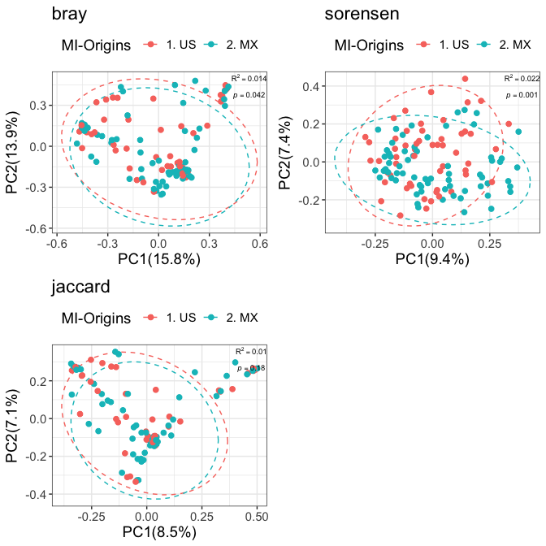

``` r
temp_phy<-subset_samples(BEAMS_1MO_Infants,
                         !is.na(BEAMS_1MO_Infants@sam_data$country_pid)
)
temp_phy<-subset_samples(temp_phy,
                         !is.na(temp_phy@sam_data$chld_sex_as)
)
temp_phy<-subset_samples(temp_phy,
                         !is.na(temp_phy@sam_data$mom_deliverytype_mrd)
)
temp_phy<-subset_samples(temp_phy,
                         !is.na(temp_phy@sam_data$chld_inffeed_cf1m)
)

test_stats2 <- beta_div_permanova_multivariate(
  phy = temp_phy,
  model_vars =   c("country_pid",
                   "chld_sex_as",
                   "mom_deliverytype_mrd",
                   "chld_inffeed_cf1m"),
  dists = c("bray", "sorensen"),
  subjectid = "family_id"
)
```

\[1\] “Running Fixed-Effects PERMANOVA Models (cross-sectional)”

## 2.5 Differential abundance

-   I use the many models script in “lm” mode on CLR-transformed data.
    You can run it in the intended mode using count data if you want
    ¯\_(ツ)\_/¯
-   The main utility of the MM script is the standardized output, which
    makes it easier to make code downstream for visualizations
-   There’s also a mode to run LME mode if you want to look at each
    dimension separately (may be useful for repeated measures data)

``` r
results_1MO_country <- many_model_script(
  phy = BEAMS_1MO_Infants_clr,
  model = "~ country_pid + mom_deliverytype_mrd  + chld_inffeed_cf1m",
  ref = "2. MX",
  pct_pres = -Inf,
  log_reads = -Inf, 
  run_models = c('lm'),
  subjectid = "family_id"
)
```

    ## phyloseq-class experiment-level object
    ## otu_table()   OTU Table:         [ 93 taxa and 120 samples ]
    ## sample_data() Sample Data:       [ 120 samples by 964 sample variables ]
    ## tax_table()   Taxonomy Table:    [ 93 taxa by 7 taxonomic ranks ]
    ## [1] "At least one filtering level has been chosen manually. Figure represents modified parameters."

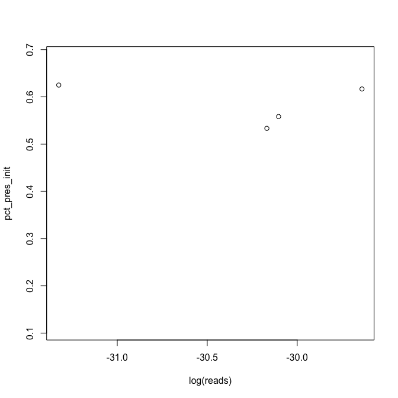

    ## [1] "89 of 93 OTUs were filtered"
    ## [1] "Your model is: ~ country_pid + mom_deliverytype_mrd  + chld_inffeed_cf1m and your variable of interest is: country_pid"
    ## 
    ## 1. US 2. MX 
    ##    54    66 
    ## [1] "The reference group changed and is now: 2. MX"
    ## [1] "Running Fixed-Effects Models"
    ## [1] "Models finished calculating..."

``` r
# Example bar plot
bar<-MM_bar_plot(mm_output=results_1MO_country,
                species_col_name="Species",
                lfc_col_name="Estimate",
                lfc_label="Estimate",
                Pvalue_col_name="Pvalue",
                Pfdr_col_name="p.fdr",
                p_cutoff=0.05,
                p_fdr_cutoff=0.1,
                positive_lfc_label="US",
                negative_lfc_label="MX",
                legend_label=NULL,
                legend_title="")
bar
```

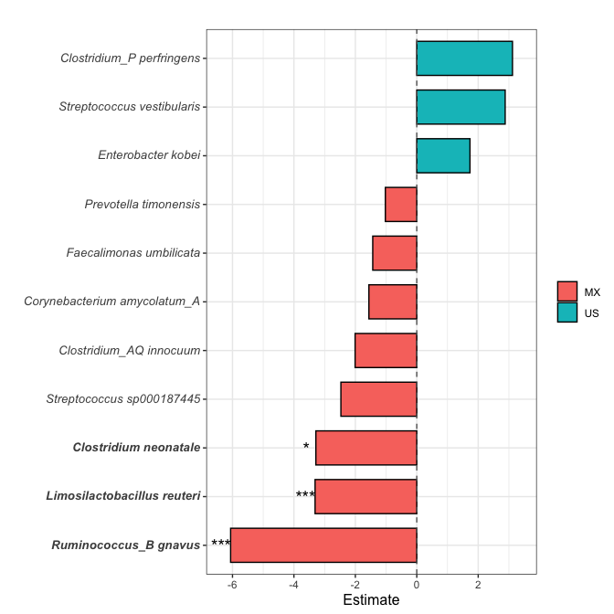

``` r
# example volcano
volc <- MM_volcano_plot(
  mm_output = results_1MO_country,
  species_col_name = "Species",
  lfc_col_name = "Estimate",
  pval_col_name = "Pvalue",
  pfdr_col_name = "p.fdr",
  phylum_col_name = "Phylum",
  label_pattern = "",
  p_cutoff = 0.05,
  p_fdr_cutoff = 0.1,
  legend_title = "",
  positive_lfc_label = "US",
  negative_lfc_label = "MX",
  plot_title = "Infant 1Mo Taxa vs Mom Origin"
)

volc
```

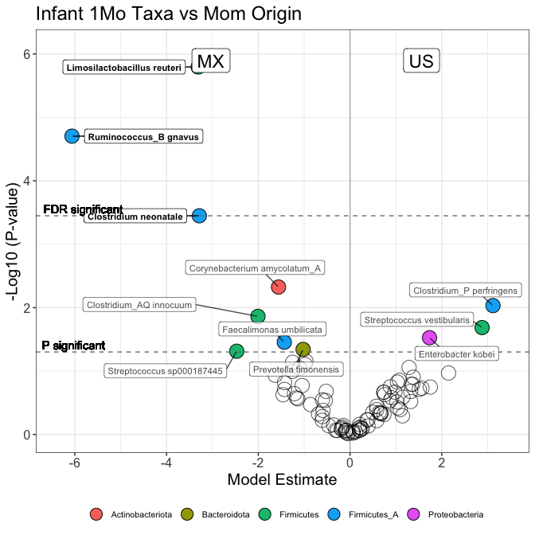

# 3 Other plots

-   None of these have been made into a function, but represent methods
    that may be broadly useful

## 3.1 Barplots: Chi-squared plot with count(%)

``` r
require(phyloseq)
require(tidyr)
require(dplyr)
require(stringr)
require(ggplot2)

phy<-readRDS("~/Library/CloudStorage/Box-Box/Lynch_Lab/Metag_processed/BEAMs/20250117_BEAMS_Paper_1_materials/2_data/20250113_BEAMS_mom_inf1mo_metabolomics_metabolon.rds")

# subset to mom and inf 1mo
phy_mom<-subset_samples(phy, 
                        sample_data(phy)$mom_baby=="MOM")
phy_baby<-subset_samples(phy,
                         sample_data(phy)$mom_baby=="BABY")

temp_bab<-phy_baby
temp_bab<-subset_samples(temp_bab, !(sample_data(temp_bab)$country_pid==""))
temp_bab<-subset_samples(temp_bab, !is.na(sample_data(temp_bab)$RSS_binary))

bab_sam<-sample_data(temp_bab)

dt <- bab_sam%>%
  dplyr::group_by(country_pid,RSS_binary)%>%
  dplyr::tally() %>%
  mutate(perc = round(proportions(n) * 100, 1),
         res = str_c(n, "(", perc, ")%"),)
m<-chisq.test(table(bab_sam$RSS_binary,bab_sam$country_pid))
p<-round(m$p.value,3)

ggplot(dt, aes(fill=RSS_binary, x=country_pid, y=perc))+
  geom_bar(stat="identity")+
  # scale_y_continuous(labels = scales::percent)+
  geom_text(aes(label=(res)), 
            position=position_stack(vjust=0.5))+
  labs(x="country_pid", y="%",title ="Infant 6-9 MO S-score by Mom Origin \n(all data)")+
  guides(fill=guide_legend(title="Infant S-score")) +
  geom_text(aes(x=-Inf, y=Inf, hjust=0, vjust=1),label=paste0("chisq=",p))
```

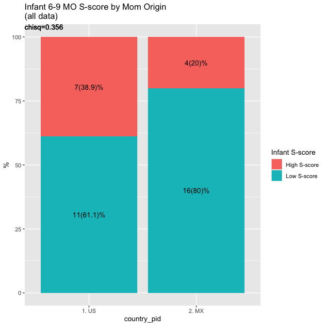

## 3.2 Calculating stats by group within time

-   Currently uses Wilcoxon test, but can be rewritten to use Kruskal or
    Anova, or anything else

``` r
require(vegan)
require(reshape2)
require(ggsignif)

phy_rarefy<-readRDS("~/Library/CloudStorage/Box-Box/BEAMS_P2_16s_Vaginal_Stool_08282024/20240918_infant_zymo_vs_diaper/20240912_16S_rarefied_sampleorigin.rds")

#############
##Alpha div##
#############

# Calculate alpha diversity indices
# Calculate OTU data and phylogenetic tree
otu_data <- t(otu_table(phy_rarefy))
phy_tree <- phy_tree(phy_rarefy)

# Calculate Shannon diversity index
shannon_diversity <- vegan::diversity(otu_data)

# Add alpha diversity indices to sample data
sample_data(phy_rarefy)$Chao1 <- t(estimateR(otu_data))[, 2]
sample_data(phy_rarefy)$Shannon <- shannon_diversity
sample_data(phy_rarefy)$Pileou_Eveness <- shannon_diversity / log(specnumber(otu_data))
sample_data(phy_rarefy)$Faith_PD <- picante::pd(otu_data, phy_tree, include.root = TRUE)[, 1]

# Prepare and melt data frame for plotting
alpha_div_df <- data.frame(
  SampleID = rownames(sample_data(phy_rarefy)),
  EventType = factor(sample_data(phy_rarefy)$EventType, 
                     levels = c("1 MO", "3 MO", "6 MO", "9 MO", "12 MO", "18 MO", "24 MO")),
  ParticipantID = sample_data(phy_rarefy)$ParticipantID,
  Sample_origin = sample_data(phy_rarefy)$Sample_origin,
  sample_data(phy_rarefy)[, c("Chao1", "Shannon", "Pileou_Eveness", "Faith_PD")]
  )

alpha_div_melted <- melt(alpha_div_df, id.vars = c("SampleID", "EventType", "ParticipantID", "Sample_origin"))
# Calculate the number of samples in each EventType
sample_counts <- table(alpha_div_df$EventType)

# Convert the counts to a data frame
sample_count_df <- as.data.frame(sample_counts)
colnames(sample_count_df) <- c("EventType", "Count")


#Stats!
#handler to catch errors if <2 groups in comparison (18 and 24 MO timepoints)
wilcox_safe<-function(alpha_vals=alpha_vals, origin=origin){
  tryCatch({
    test<-wilcox.test(alpha_vals~origin, exact=F)
    test$p.value
  }, error = function(e) {
    message("Group has only one factor, comparison not run")
    return(NA)
  })
}

mean_sd<-function(alpha_vals=alpha_vals, origin=origin, num_groups=num_groups){
  tryCatch({
    m<-aggregate(alpha_vals,list(origin), mean)
    sd<-aggregate(alpha_vals,list(origin), sd)

    collect<-data.frame(NA)
    for (i in 1:nrow(m)) {
      m_sd<-paste(round(m$x[i],3),"\u00B1",round(sd$x[i],3))
      collect<-cbind(collect,m_sd)
    }
    colnames(collect)<-c(NA,c(m$Group.1))
    if(length(collect)>num_groups){
      collect[,-1]
    }else(
      collect
    )

  }, error = function(e) {
    temp<-t(data.frame(rep(NA,num_groups)))
    return(temp)
  })
}

#alpha stats by wilcoxon
pvals<-data.frame()
alpha_variables<-c("Chao1", "Shannon", "Pileou_Eveness", "Faith_PD")
time<-levels(alpha_div_df$EventType)
num_groups<-length(unique(alpha_div_df$Sample_origin))
for(i in alpha_variables){
  for(j in time){
    
    alpha_by_time<-alpha_div_df[alpha_div_df$EventType==j,]
    alpha_vals<-alpha_by_time[,colnames(alpha_by_time)==i]
    origin<-alpha_by_time$Sample_origin

    m_sd<-mean_sd(alpha_vals, origin, num_groups)
    p<-wilcox_safe(alpha_vals, origin)
    
    #concat
    collect<-data.frame(i,j,
               m_sd,
               p)

    pvals<-rbind(pvals, setNames(collect, names(pvals)))
  }
}
colnames(pvals)<-c("alpha_measure","timepoint","diapers (mean\u00B1sd)","zymo (mean\u00B1sd)","pvalue")

# ggplot of alpha div by month and sample_origin
alpha_plot<-ggplot(alpha_div_melted, aes(x = EventType, y = value, shape = EventType,  fill = Sample_origin)) +
  geom_violin(alpha = 0.5, trim = FALSE, drop=F) +
  geom_boxplot(alpha = 0.7, outlier.shape = NA,
               position = position_dodge()) +
  geom_jitter(size = 1, alpha = 0.6,
              position = position_jitterdodge()) +
  labs(y = "Diversity Index", x = "", fill = "EventType") +
  theme_bw() +
  theme(
    axis.text.x = element_text(size = 12, face = "bold", angle = 45, hjust = 1),  # Bold and angled x-axis text
    axis.title = element_text(size = 16, face = "bold"),
    strip.text.x = element_text(size = 12),
    legend.text = element_text(size = 10),
    legend.title = element_text(size = 12, face = "bold")
  ) +
  scale_shape_manual(name = "EventType",
                     values = c(rep(16,7))
  ) +
  facet_wrap(~variable, scales = "free_y", labeller = labeller(variable = c(
    Chao1 = "Chao1 Richness",
    Shannon = "Shannon Index",
    Pileou_Eveness = "Pileou's Evenness",
    Faith_PD = "Faith's Phylogenetic Diversity"
  ))) +
  geom_text(data = sample_count_df, aes(x = EventType, y = 0, label = paste("n =", Count)),
            vjust = 1.5, size = 3.5, color = "black", inherit.aes = FALSE)+
  guides(fill = "legend", shape = "none")


# pull x-axis coordinates to plot significance
plot_stats<-ggplot_build(alpha_plot)
#view<-plot_stats$data[2][[1]]
x_min<-plot_stats$data[2][[1]]$xmin
x_max<-plot_stats$data[2][[1]]$xmax
y_max<-plot_stats$data[2][[1]]$ymax_final


comp_coord<-function(coord){
  coord_composite<-c()
  for(i in seq(1, length(coord), 2)){
    coord_max<-max(coord[i],coord[i+1])
    coord_composite<-c(coord_composite,coord_max)
  }
  return(coord_composite)
}

# note that the last two timepoints don't have comparisons, so skip these
# I'm manually curating the data for now
# I think every 6 and 7th value in blocks of 7 need to be changed to NA
x_min_composite<-plot_stats$data[2][[1]]$x[c(TRUE,FALSE)]
x_min_composite[c(6,12,18,24)]<-NA
x_max_composite<-plot_stats$data[2][[1]]$x[c(FALSE,TRUE)]
x_max_composite[c(6,12,18,24)]<-NA

#find approxiamte y-value for each pair comparison
y_composite<-comp_coord(y_max)*1.1
y_composite[c(6,12,18,24)]<-NA

#create labels for significance
sig_lab<-ifelse(pvals$pvalue<0.05,"*",
                ifelse(pvals$pvalue>=0.05, "NS",
                NA)
                )
# I don't quite understand how to do this the "correct way" but the sig_lab has 4 extra rows, so Imma just remove
# the 24 Mo timepoint to get all my indeces to a length of 24
sig_lab<-sig_lab[pvals$timepoint!="24 MO"]


x_len<-length(x_min_composite)
annotation_df <- data.frame(
  variable = c(rep("Chao1",x_len/4), 
               rep("Shannon",x_len/4), 
               rep("Pileou_Eveness",x_len/4),
               rep("Faith_PD",x_len/4)),
  start = x_min_composite,
  end = x_max_composite,
  y = y_composite,
  label = sig_lab
)
# we have to add each row number as it's own group, otherwise the annotation * doesn't plot correctly 
# see: https://github.com/const-ae/ggsignif/issues/63
annotation_df$group <- 1:nrow(annotation_df)

alpha_plot+
  geom_signif(data = annotation_df,
              aes(y_position = y,
                  xmin = start,
                  xmax = end,
                  annotations = label,
                  group=group),
              inherit.aes = F,
              tip_length=0, manual=T)
```

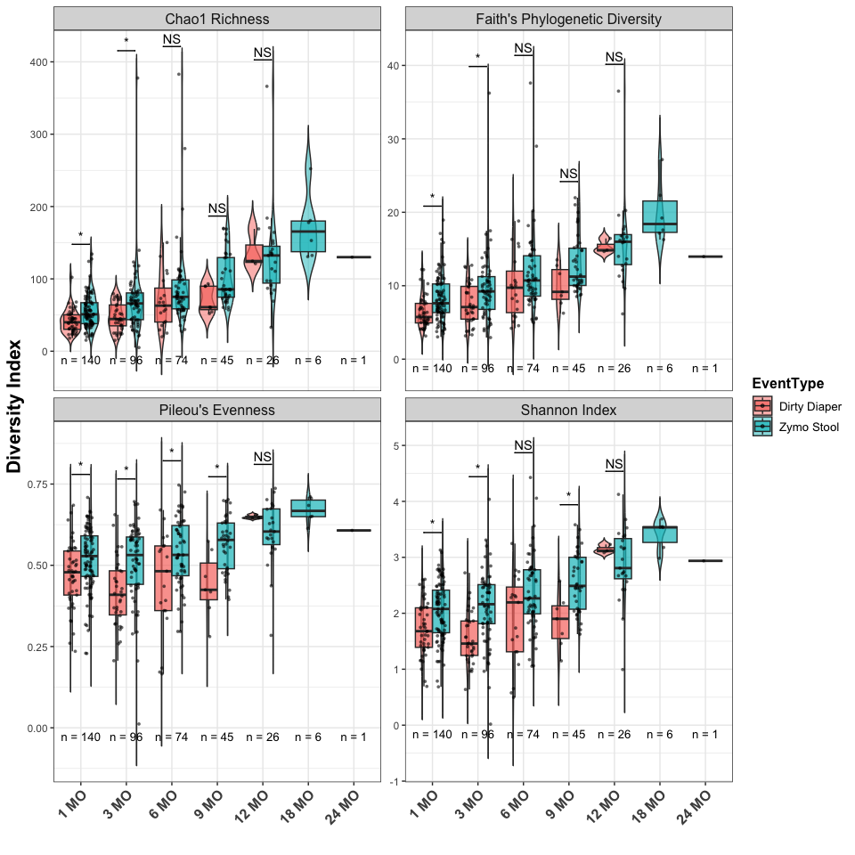

# 4 PCA on log-transformed metabolomics

``` r
require(phyloseq)
require(ggplot2)

# Example
phy<-readRDS("~/Library/CloudStorage/Box-Box/Lynch_Lab/Metag_processed/BEAMs/20250117_BEAMS_Paper_1_materials/2_data/20250113_BEAMS_mom_inf1mo_metabolomics_metabolon.rds")

# subset to mom and inf 1mo
phy_mom<-subset_samples(phy, 
                        sample_data(phy)$mom_baby=="MOM")
phy_baby<-subset_samples(phy,
                         sample_data(phy)$mom_baby=="BABY")
# change to factor and reorder
sample_data(phy_mom)$mom_origins<-factor(sample_data(phy_mom)$mom_origins, levels=c("3. MX MX","1. US US", "2. MX US"))
sample_data(phy_mom)$teer24_tertiles<-factor(sample_data(phy_mom)$teer24_tertiles)

# calc beta plots and diff abund results
vars_temp<-c("mom_origins",
             "teer24_tertiles")

# set up group colors
temp1<-list(`High S-score`="#CAB2D6",
            `Low S-score`="salmon")
temp2<-list(`1. US US`="#f2788e",
            `2. MX US`="#8fbbe0",
            `3. MX MX`="#6db39c")
temp3<-list(`High TEER`="lightgoldenrod",
            `Intermediate TEER`="aquamarine3",
            `Low TEER`="lightblue")
temp4<-list("1. only BM"="orchid1",
            "2. BM & F"="brown",
            "3. only F"="#FDBF6F")

vars_cols<-list("RSS_binary"=temp1,
                "mom_origins"=temp2,
                "teer24_tertiles"=temp3)

collect_stats<-list()
collect_plots<-list()
for(i in seq_along(vars_temp)){
  # subset to rows with complete S-scores
  phy_mom_sub<-subset_samples(phy_mom, !is.na(phy_mom@sam_data[,which(colnames(phy_mom@sam_data)==vars_temp[i])]))
  phy_mom_sub<-subset_samples(phy_mom_sub, phy_mom_sub@sam_data[,which(colnames(phy_mom_sub@sam_data)==vars_temp[i])]!="")
  
  ######
  # create new var to plot from
  # Mom
  # subset infant 1mo s-score
  phy_temp<-phy_mom_sub
  # find correct column variable
  which_col<-which(colnames(phy_temp@sam_data)==vars_temp[i])
  # pull out group
  group<-data.frame(sample_data(phy_temp)[,which_col])[,1]
  # get group counts
  n_count<-length(group)
  
  # pull out metabolomics
  otu<-data.frame(otu_table(phy_temp))
  # remove columns of NAs or NAN
  otu_trans<-otu[,!colSums(otu)=="NaN"]
  # remove columns that are basically constant; here we're using 5 unique values as the cutoff (the rest are repeats due to imputation, probably)
  otu_trans<-otu_trans[vapply(otu_trans, function(x) length(unique(x)) > 5, logical(1L))]
  
  # Scale the data (optional but often done in PCA)
  data_scaled <- scale(otu_trans)
  # Perform PCA
  pca_result <- prcomp(data_scaled)
  
    # # LM stats
    # Axis1 <- pca_result$x[,1]
    # Axis2 <- pca_result$x[,2]
    # ##Performed linear model analysis on different metadata variables
    # m1 <- lm(Axis1 ~ group)
    # a1<-anova(m1)
    # m2 <- lm(Axis2 ~ group)
    # a2<-anova(m2)

  # manova stats
  manova_result <- manova(cbind(PC1, PC2, PC3) ~ group, data = data.frame(pca_result$x))
  a3<-summary(manova_result, test = "Wilks")
  a3$n_count<-n_count
  collect_stats[[i]]<-a3
  # store r-sq
  rs<-summary.lm(manova_result)$r.squared
  
  # Plot PCA results
  pca_data <- data.frame(pca_result$x)  # PCA scores
  p<-ggplot(pca_data, aes(PC1, PC2)) +
    geom_point(aes(color = factor(group)), size=4) +
    stat_ellipse(aes(color = factor(group)))+
    labs(title = paste0("PCA of Metabolomics Data vs ",vars_temp[i]), x = "PC1", y = "PC2", color = "") +
    theme_minimal()+
    # annotate("text", x=Inf, y=Inf, label=paste('LM_PC1_P== ', round(a1$`Pr(>F)`[1], 3)), 
    #          hjust=1, vjust=1, parse=TRUE, size=8)+
    # annotate("text", x=Inf, y=Inf, label=paste('LM_PC2_P== ', round(a2$`Pr(>F)`[1], 3)), 
    #          hjust=1, vjust=2, parse=TRUE, size=8)+
    annotate("text", x=Inf, y=Inf, label=paste('MANOVA_Rsq== ', round(rs,3)), 
             hjust=1, vjust=1, parse=TRUE, size=8)+
    annotate("text", x=Inf, y=Inf, label=paste('MANOVA_P== ', round(a3$stats[11], 3)), 
             hjust=1, vjust=2, parse=TRUE, size=8)+
    theme(legend.text = element_text(size=14))
  
  if(vars_temp[i]%in%names(vars_cols)){
    temp<-as.character(vars_cols[[vars_temp[i]]])
    p<-p+scale_color_manual(values=temp)
  }
  
  collect_plots[[i]]<-ggplotGrob(p)
  # collect_plots[[i]]<-p
}
names(collect_stats)<-vars_temp
names(collect_plots)<-vars_temp
collect<-list(stats=collect_stats,
              plots=collect_plots)

plot(collect$plots$mom_origins)
```

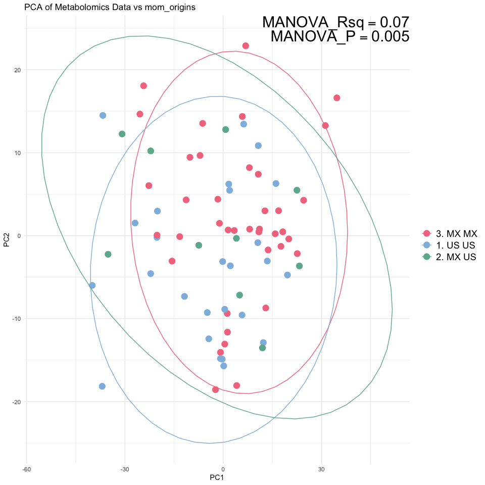

``` r
plot(collect$plots$teer24_tertiles)
```

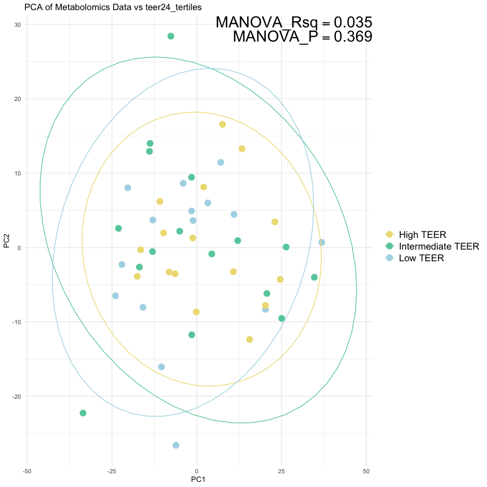
